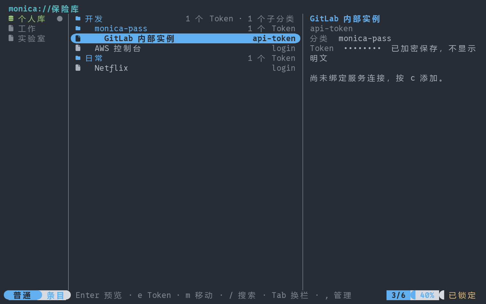
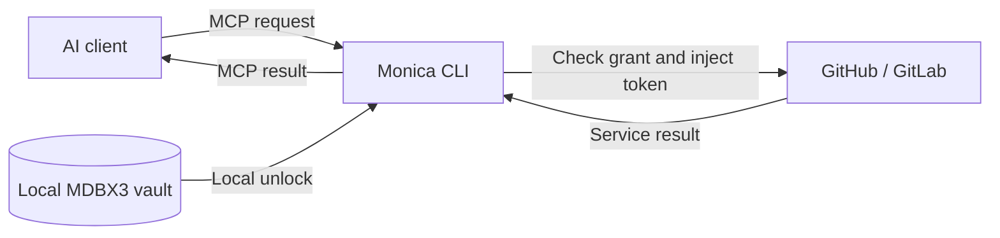
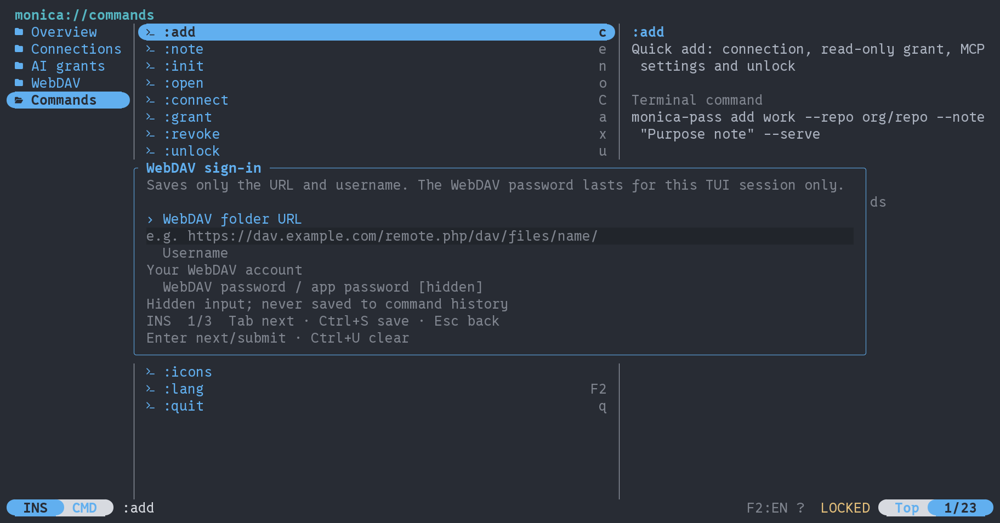

<h1 align="center">Monica CLI</h1>

<div align="center">

**English** · [简体中文](README.md)


<br/>


**Monica's local credential gateway: let AI use service tokens within the permissions you grant.**

<p>Day-to-day password management lives in Monica for Android; this end owns only the boundary between AI and its credentials · service tokens stay in a local encrypted MDBX3 vault · every authorization expires · you unlock and revoke</p>

<p>
Part of the <a href="https://github.com/Monica-Pass/Monica"><strong>Monica local password manager</strong></a> family ·
<a href="https://monica-pass.github.io/MonicaDocs/">Monica documentation site</a>
</p>

[](https://github.com/Monica-Pass/Monica)
[](https://github.com/Monica-Pass/Monica/releases)
[](docs/redesign-progress.md)
[](#build-from-source)
[](#build-from-source)
<br>
[](https://afdian.com/a/JoyinJoester)
[](https://ko-fi.com/joyinjoester)
[](https://www.paypal.com/ncp/payment/BHSYWK73CA8FW)
[](https://liberapay.com/JoyinJoester)
[](https://qm.qq.com/q/2vTdTkHV3u)
[](https://t.me/+IZUDLL-vWOA1Y2U1)

</div>

[Implementation status](docs/redesign-progress.md) · [Source dependencies](docs/source-checkout.md) · [Token / Android format](docs/token-format.md)

Monica CLI stores service tokens in a local, encrypted MDBX3 vault. AI requests an operation through MCP; Monica checks the grant, injects the credential, sends the request, and returns the service result. You manage credentials and permissions, while AI uses connection names and purpose notes to understand which service to use without directly holding the raw token.

[What this is](#what-this-actually-is) · [Quick start](#quick-start) · [Connect an AI client](#connect-an-ai-client) · [WebDAV vaults](#webdav-vaults) · [Build from source](#build-from-source) · [Monica main repository](https://github.com/Monica-Pass/Monica) · [This repository](https://github.com/Monica-Pass/Monica-cli)



*Database and nested-category home rendered from synthetic test data. The interface supports English and Simplified Chinese.*

## What this actually is

**Monica is the password manager. Monica CLI is not.** The day-to-day vault for accounts, passwords, and 2FA is [Monica for Android](https://github.com/Monica-Pass/Monica), which has TOTP, autofill, card and identity entries, and browser integration. This tool does one job: **it stands between AI and your remote services, holding the tokens and deciding what AI may do with them.**

Concretely:

- **It manages the credentials you hand to AI**, such as GitHub / GitLab API tokens — not your entire password set.
- **It keeps the token away from AI.** AI can only ask for an operation, like "list the Issues in this repository"; grant checks, token injection, request sending, and leak checks on the response all happen in the local gateway. The raw token never enters the model's context.
- **It puts time on permissions.** Every AI authorization expires, can carry a call budget, and can only be renewed by a person running `refresh` locally — **no grant is permanent**. The credential stored in your vault does not expire and is not deleted when a grant ends.
- **It can ask you first.** With `--approval write` a grant asks before every write, and with `--approval all` before every call. The prompt appears only in your own terminal — the TUI modal or the `serve` prompt — and waits at most 15 seconds; nobody answering means `approval_timeout`. AI sees the gate in the catalog but cannot answer it, and a command like `monica approve` **deliberately does not exist**. A refused call spends none of the grant's call budget.
- **It also manages this database**, because configuring grants, checking status, and syncing over WebDAV should not require picking up a phone.

It reads and writes **the same MDBX3 database** as the phone app, so the two are entry points into one vault rather than two unrelated stores. What it deliberately does not do: no TOTP generation, no autofill, no browser extension, no KeePass / Bitwarden import, and no external attachments — a vault with `.blobs` is refused outright with `external_blobs_unsupported`.

> If you want "one app for all my passwords", that is the [main repository](https://github.com/Monica-Pass/Monica). If you want "let AI open Issues and review PRs for me, without ever holding my token", that is this one.

## The Monica family

Monica is a local-first password manager that brings **Bitwarden** and **KeePass** together; this repository is its command-line and AI gateway end, reading and writing the same MDBX3 databases as the phone app.

| Component | What it does | Where |
| --- | --- | --- |
| Monica for Android | Everyday use on the phone: local vault, TOTP, autofill, WebDAV sync | [Main repository](https://github.com/Monica-Pass/Monica) · [Releases](https://github.com/Monica-Pass/Monica/releases) |
| Monica CLI (this repository) | Local credential gateway: human management plus AI access inside your grants | Here |
| Monica documentation site | Full end-user documentation | [MonicaDocs](https://monica-pass.github.io/MonicaDocs/) |

Phone and command line share one database: after this tool creates a vault, stores a token and syncs over WebDAV, Monica for Android opens the same `.mdbx` file and keeps editing the same entries. The root-collection and key-entry rules are covered in [WebDAV vaults](#webdav-vaults).

> The whole project is maintained by one person. Priorities are Android features and stability, then the CLI's authorization boundaries, then documentation. Thanks for your understanding.

## What Monica does

| Feature | How it works |
| --- | --- |
| Local credential management | Encrypt tokens in MDBX3 and unlock them with a master password. Create connections in the TUI or from the command line. |
| Service access for AI | Connect MCP-compatible AI clients to GitHub and GitLab through the standard MCP stdio interface. |
| Calls by connection name | Give connections names such as `work-github` and public purpose notes. AI can discover their granted scope and call them by name. |
| Permission controls | Set the connection, repositories, allowed operations, expiry, per-minute limit, and total call budget. Grants are read-only by default, can be revoked, and are never permanent. |
| Terminal manager | Browse a Yazi-style three-pane layout with Vim-style keys, fuzzy search, detail previews, one-key copy of public key fields, and a command browser. |
| CLI automation | Short aliases, explicit parameters, secure non-interactive input, and stable JSON results let AI perform local management operations. |
| Interface languages | Simplified Chinese and English across the TUI, forms, CLI help and human-facing messages, with automatic selection and saved preferences. |
| WebDAV vaults | Sign in to WebDAV, browse remote MDBX files, open local copies, and manually sync encrypted vaults. |
| SSH / GPG key entries | Keep SSH private keys and OpenPGP certificates in the same encrypted vault, stored in exactly the format Monica for Android uses. Generate Ed25519 and RSA, import PEM and armor, and export to a file explicitly. The AI never sees these entries. |

**GitHub / GitLab service API proxying is available alongside repository-scoped Issue tools.** Explicit service-wide grants support branches, commits, MR/PRs, comments, pipelines and other API endpoints without adding new Monica tools. See [service API usage](docs/service-api.md). Both hosted services and manually configured HTTPS API endpoints for self-hosted installations are supported.



## Quick start

On Windows, first follow [Build from source](#build-from-source) to produce `target/release/monica-pass.exe`, then run `./scripts/install.ps1 -InstallDir D:\Apps\MonicaCLI`. The installer uses that build by default and accepts `-Source` for another executable; `-InstallDir` must be an absolute path and not a drive root, a non-empty target is only accepted when it is already a Monica portable install, and Monica must be closed before updating. The install writes `monica-pass.exe` plus `monica` and `monicapass` entry points, adds them to your user PATH, and keeps configuration, vault and logs in the `data/` directory beside them. Open a new terminal and run `monica`. The installed copy does not track the repository: if a recent command such as `monica refresh` is reported as unknown, the installed copy is behind the source and needs a rebuild and reinstall.

The default home shows databases, nested categories, and entries:

1. Press `Enter` to create your first database, or `o` to open an MDBX file. Its password protects the encrypted database.
2. Press `Enter` to browse. Use `n` to create a category and `c` to save a service Token in the selected category.
3. Press `F3` to open settings when you need AI grants, MCP configuration, or WebDAV sync.

While the database is locked, the middle pane lists selectable action rows (open the database, open a local MDBX file, create a database) instead of a wall of hints; `Enter` runs the highlighted row.

| Home action | Key |
| --- | --- |
| Database rail: choose / switch / create | `d`, then `j`/`k` and `Enter` / `n` |
| Move / first and last / page | `j`/`k` / `g`/`G` / `PgUp`/`PgDn` |
| Open category / parent | `Enter` / `h`, `Backspace` or `Left` |
| Cycle the database, list and detail panes | `Tab` / `Shift+Tab` |
| Search categories and entries across the database (subsequence match) | `/` |
| New category / service Token | `n` / `c` |
| New SSH key / import a private key / import OpenPGP | `S` / `I` / `A` |
| Copy the public line or user id / copy the fingerprint (key rows) | `y` / `Y` |
| Rename category / replace Token | `e` |
| Move to another category | `m` |
| Delete the selected row (type its name back; a category must be empty) | `D` |
| Open an MDBX file | `o` |
| Help / last message / commands (e.g. `:lock`) | `?` / `!` / `:` |
| Home / settings | `F3` or `,` |
| Language / quit | `F2` / `q` |

`/` matches a subsequence and ranks by relevance: `sk` finds `ssh-key`, spaces still narrow term by term, and the closest hit stays at the top. `y` and `Y` write only a key entry's public fields to the clipboard (the public key line, the user id, the fingerprint); Tokens and private key material have no path to the clipboard, and the command line never writes it either. `D` deletes the selected row: the confirmation form asks you to type the name yourself, an empty field never stands in for your consent. A credential bound to a connection is deleted through that connection, which revokes its grants, and a category that still holds anything only tells you how much is left.

In edit forms, `Tab` moves between fields and `Ctrl+S` opens a separate database-password step. `Esc` in that step returns to the draft and clears the password. Each management operation unlocks the database only while it runs; summary metadata is cached for at most five minutes. This is separate from the AI broker's five-minute unlock session.

In settings, press `c` for guided service setup, or `a` to configure an explicit grant. Every authorization **expires**: the default lifetime is 240 minutes (`--ttl`, 1–1440; leaving the field blank no longer means forever), and `--max-calls` can additionally cap how many upstream calls that grant may make. Once the window or the call budget is spent the AI only receives `reauthorization_required`, and a person must run `monica refresh GRANT` locally — command line only for now, with no TUI key — which issues a new capability, so the MCP client must be restarted to pick it up. Grants stay revocable and still require an active unlocked broker. Token replacement revokes existing grants for that connection.

The same grants can carry a **human approval gate**: `monica grant … --approval write` asks before writes, `--approval all` asks before every call, and `monica rf GRANT --approval all` sets it while renewing (`off` is the default and never asks). The TUI grant form has an **Approval gate** field for the same thing. The quick `add` path has no such flag, so its grants are always `off`; set the gate afterwards with `grant` or `rf`. `st` now shows the setting in a `Gate` column. See section 6.5 of [docs/human-guide.md](docs/human-guide.md) (Chinese) for measured prompts and timings.

The home tree always carries an **AI grants** row (locked vault included) whose suffix counts the authorizations currently in force. `Enter` opens the list: live rows show read-only or read-write scope, expired and "Calls used up" rows are dimmed, and the preview of the selected row shows `used/max` calls — so you can see which proxies are still serving without drilling into the database.

Use a UTF-8 terminal at least **70 columns × 20 rows**. Settings retain `/` filtering, `1`–`5` page navigation and `:` commands.

### Interface language

Monica includes **Simplified Chinese** and **English**. The first launch follows the system locale, with English as the fallback for unsupported languages.

Press `F2` in the TUI to switch and save, or enter `:lang en`, `:lang zh-CN` or `:lang auto`. Switching preserves your selection and form input.

```sh
monica-pass --lang en
monica-pass --lang zh-CN --help
monica-pass language en
monica-pass language auto
```

`--lang` applies to one run. The `language` command saves a preference; omit its argument to view the current setting. No vault creation or unlock is required. The preference is saved as `gateway.preferences.json` next to the configuration; a different `--config` filename uses its own preference file.

Precedence is: `--lang` → the `MONICA_LANG` environment variable → saved preference → system locale. Automatic mode checks `LC_ALL`, `LC_MESSAGES` and `LANG`; on Windows, it uses the system locale when those variables are unset.

Connection names and purpose notes are shown as entered. CLI JSON output, MCP tool names, arguments and error codes stay stable across interface languages.

A connection name is an ASCII handle (`[A-Za-z0-9_-]`); grants, MCP config and command arguments all reference it. Each entry can also carry an optional display title (`--title`, CJK allowed, ≤256 UTF-8 bytes) that only affects how the vault list is shown, falling back to the handle when blank. Rename an existing entry with `rename-entry <handle> <new title>`, or press `r` on a selected entry in the TUI. Renaming changes only the display title — the encrypted payload and AI grants are untouched, and the AI always uses the handle.

### Start from the command line

You can also create a vault, add a connection, issue a grant, and unlock the gateway with one command:

```sh
monica-pass add work-github --repo your-org/your-repo --note "Track product issues and feature requests" --serve
```

Monica prompts for the token and master password using hidden input. `--serve` keeps the gateway running after setup. Without it, the command exits after saving the configuration; run `monica-pass serve` when you want to unlock the gateway.

For GitLab:

```sh
monica-pass add work-gitlab --provider gitlab --repo your-group/your-project --note "Handle Issues for the team project" --serve
```

Repeat `--repo` to grant access to multiple repositories. To allow Issue creation, explicitly add `--allow-write`, or press `a` in the TUI to create a suitable grant for an existing connection.

Common management commands:

```sh
monica-pass list
monica-pass note work-github "Track Issues in the documentation repository"
monica-pass serve
monica-pass lock
```

You can also use `init`, `connect`, and `grant` to create a vault, save a connection, and configure a grant separately. Run `monica-pass --help` or `monica-pass <subcommand> --help` for the available options.

Deletion is three commands by target: `delete CONNECTION` removes the connection, the credential it binds and every grant under it; `delete ENTRY_ID` removes one entry that no connection binds; `delete-category CATEGORY_ID` (`rmdir`) removes an empty category only and refuses while anything is left inside, reporting the counts. The folder Monica for Android saves new entries into can neither be deleted nor moved (`protected_collection`) — without it the vault turns read-only on the phone again. Key entries go through `keys delete NAME`.

```sh
monica-pass library                       # entry and category IDs
monica-pass delete work-github            # asks you to type work-github back
monica-pass delete-category 3f2a…-id      # the category must already be empty
monica-pass keys delete laptop --force
```

In a human terminal you must type the target back exactly before anything happens; `--force` is the opt-out once you have checked the target. A scripted caller injecting secrets through `--secrets-stdin` has no person to ask, so without `--force` it gets `confirmation_required` — silence is never read as consent. A delete writes a tombstone: every listing and the AI side stop seeing the row, and the tombstone rides segment sync to your other devices. The ciphertext itself stays inside the database file (the engine has no purge path yet), and key text you already exported to disk is not retracted. Nothing undoes a delete; restoring an earlier backup is the only way back (see [human-guide.md section 8](docs/human-guide.md)).

### Short commands and names

Aliases are equivalent to the full commands. Common options also have short forms:

```sh
monica-pass a work-github -r your-org/your-repo -n "Track product issues" -s
monica-pass ls
monica-pass show work-github
monica-pass e work-github "Track documentation issues"
monica-pass m work-github
monica-pass ck work-github
```

| Action | Full command | Alias |
| --- | --- | --- |
| Quick add / save a connection | `add` / `connect` | `a` / `c` |
| List connections / edit purpose | `list` / `note` | `ls` / `e` |
| Create / open a local vault | `init` / `open` | `n` / `o` |
| Issue / refresh / revoke a grant | `grant` / `refresh` / `revoke` | `g` / `rf` / `rv` |
| Put a human approval gate on a grant | `grant --approval off\|write\|all` / `refresh --approval <policy>` | Approval gate field |
| Unlock and serve / lock | `serve` / `lock` | `u` / `lk` |
| MCP settings / check discovery | `settings` / `check` | `m` / `ck` |
| Status / WebDAV / command discovery | `status` / `webdav` / `commands` | `st` / `dav` / `cmds` |
| Delete a connection or entry / delete an empty category | `delete` / `delete-category` | `rm`, `del` / `rmdir` |

`audit` reads the local gateway trail (`--grant <name>` to filter, `--limit <n>` for the most recent rows, newest first). It needs no master password and never contains credential material.

Use `-r` for a repository, `-p` for the provider, `-n` for a purpose note, `-t` for grant lifetime, and `-s` to serve after adding. The approval gate is `--approval off|write|all` and has no short form. Global `-C` selects the configuration file and `-l` selects the language. TUI keys remain as shown in its footer.

`show` selects a connection name and displays its public purpose and grants. `m` and `ck` select a grant name; quick add uses the same name for both. Management that accesses the vault, including sync, first stops the broker and drains in-flight requests. It leaves the broker locked; run `u`, or press `u` in the TUI, to resume MCP access. Metadata queries and revocation do not stop the broker.

### AI management through the CLI

Vault creation, opening, connection creation, purpose edits, grants, revocation, WebDAV, and broker management all have CLI entry points. AI can discover parameters and operate by name:

```sh
monica-pass cmds --json
monica-pass cmds add --json
monica-pass ls --json
monica-pass show work-github --json
monica-pass m work-github --json
```

`--json` (`-j`) returns `ok`, `command`, `data` or a fixed error code and disables prompts. Results do not depend on the interface language. `--non-interactive` disables prompts without changing the output format. With no subcommand, normal mode opens the TUI; JSON or non-interactive mode shows status.

Without `--json`, `databases`, `library` and `webdav list` print aligned tables whose headers follow the interface language, each row carrying the ID the next command needs, and write commands answer with a single confirmation line. The JSON shapes are unchanged; scripts always use `--json`.

Operations needing credentials accept `--secrets-stdin`. For example, AI can start this command while a **trusted local launcher** sends the `password` and `token` fields directly to its stdin:

```sh
monica-pass a work-github -r your-org/your-repo -n "Track product issues" --json --secrets-stdin
```

Secrets do not need to pass through the model, command arguments, environment variables, or output. Missing input returns `secret_input_required` and the required field names. See [CLI automation](docs/automation.en.md) for the input contract, launcher example, and operation mapping.

## Connect an AI client

Monica provides an **MCP stdio** service. Use the configuration generated by the program: quick add displays and saves it; press `m` on a selected grant or run `monica-pass m <grant-name>` to retrieve it again.

The following is a common JSON configuration format. Both paths are examples; use the paths generated by your Monica installation. For clients that use TOML or another format, configure the same `command` and `args`.

```json
{
  "mcpServers": {
    "monica-work": {
      "command": "C:/Tools/Monica/monica-pass.exe",
      "args": [
        "mcp",
        "--client",
        "C:/MonicaData/clients/agent-read.client.json"
      ]
    }
  }
}
```

Each grant binds to one connection. To use multiple connections, add their corresponding MCP server entries to your AI client. The AI client starts the MCP entry point; the human-operated TUI or `serve` terminal unlocks the gateway.

Rather than pasting by hand, one command merges that entry into the client's own configuration file — it backs the file up first, touches only this one entry, and refuses a file whose shape it cannot read back:

```sh
monica-pass settings GRANT --install claude   # or cursor / codex / vscode
```

Claude Desktop and project-level config files still take the JSON above. Section 4 of the [human guide](docs/human-guide.md) lists which file each client gets written into and the exact guarantees.

There is also a ready-made behavioral rulebook for the AI side: copy [docs/agent-policies/AGENTS.md](docs/agent-policies/AGENTS.md) into whatever rules file your client reads (`CLAUDE.md`, a project `AGENTS.md`, Cursor rules, Copilot instructions). It is Simplified Chinese only so far.

### Help AI understand a connection's purpose

AI can call `monica_list_connections` with `{}` to discover the connection covered by its grant: its name, provider, purpose note, repository scope, available tools, and the expiry of that AI authorization. The credential stored in your vault does not expire.

For example, name a connection `work-github` and give it the note “Track product issues and feature requests.” AI can use that context to choose the connection for a task. An MCP call to list Issues looks like this:

```json
{
  "name": "github_list_issues",
  "arguments": {
    "connection": "work-github"
  }
}
```

The `repository` argument can be omitted when the grant covers exactly one repository. With multiple repositories, it must be specified. Names and notes describe the purpose; the grant determines the actual permissions.

### Available service tools

| Operation | GitHub | GitLab |
| --- | --- | --- |
| List Issues | `github_list_issues` | `gitlab_list_issues` |
| Read an Issue | `github_get_issue` | `gitlab_get_issue` |
| Create an Issue | `github_create_issue` | `gitlab_create_issue` |
| Service API read | `github_api_read` | `gitlab_api_read` |
| Service API write / GraphQL | `github_api_write` | `gitlab_api_write` |

Reading an Issue requires `number`, which is the project-local Issue IID on GitLab. Creation requires explicit write permission, a `title`, and a UUID `request_id`. Reuse the same ID and arguments when retrying the same creation to avoid duplicates. If the result is `write_outcome_unknown`, check the remote repository before taking further action.

## WebDAV vaults

Sign in and manage WebDAV vaults directly from the TUI:

1. Press `i` and enter the WebDAV folder's **HTTPS URL, username, and password or app password**.
2. Browse the WebDAV list and press `Enter` to open an `.mdbx` file, then enter its master password. Monica creates a local encrypted copy, so later gateway use does not require an ongoing WebDAV connection.
3. Press `s` to manually sync the connected vault. If you are starting with a local vault, first press `P` to publish it under a new remote filename, then use `s` to sync.

You enter the WebDAV password once. After the sign-in succeeds it is kept in **this computer's credential store** (Windows Credential Manager, the macOS Keychain, or a Linux Secret Service entry; the password never becomes a process argument), so opening and syncing only ask for the vault master password. The URL and username are saved as before, and `:logout` ends just this session — it does not forget the stored password. Use `webdav forget-password` to remove it. These operations are also available from the command line:

```sh
monica-pass webdav login --url https://dav.example.com/monica/ --username your-name
monica-pass webdav list
monica-pass webdav open vault.mdbx
monica-pass webdav sync
monica-pass webdav forget-password
```

A password you type at the prompt follows the same route into the credential manager; a password injected through `--secrets-stdin` is **used only inside that process and never stored**. `monica-pass dav st` shows the saved connection and whether a password is stored, without touching the network. Single-file sync compares local and remote versions and reports a conflict if both have changed. You can publish the local version under a new filename before resolving the conflict. Opening a different vault preserves the previous local file and clears existing AI grants.

Supported vaults are password-unlocked, **self-contained MDBX files up to 64 MiB**. External `.blobs` attachments are not supported. A remote comes in two shapes: a lone `.mdbx` file syncs whole-file, which needs strong ETags and conditional writes from the server to replace it and stays readable without them; a same-named `.sync` folder — what Monica Android maintains — switches to segment-stream merging, where the engine merges commits, each device only writes immutable segments into its own stream, the one-time bootstrap is never replaced, and no strong ETag is required because every segment is read back and digest-checked after upload. A replay prints one progress line per segment; `Ctrl+C` stops it at a segment boundary with the cursor already on disk, so the next run resumes where it left off, and a second press exits immediately.

In single-file mode, some services, including the tested Jianguoyun endpoint, do not return strong ETags. Creating, reading, and downloading files still work; save later local changes under a new remote filename with `P` or `webdav publish NEW_NAME.mdbx`. The TUI preview and `safe_remote_replace: false` in `webdav status --json` make this limitation explicit. Monica does not force an overwrite.

MDBX3 is the runtime version; native vaults currently carry the `MDBX-2` format marker. Some older Android clients produced `MDBX-1` vaults with different encryption and unlock structures. These cannot be opened directly: Monica returns `vault_schema_unsupported` and preserves the original. Use a native MDBX3 vault; renaming the extension or changing the format marker does not convert a vault.

Before writing, Monica for Android looks up its root folder by a fixed id derived from the vault id (`nameUUIDFromBytes("monica-root:" + vault id)`, a version-3 UUID). Reading does not need that row, writing does. This tool seeds it when creating a vault and re-creates or restores it during any unlock of a vault built by an older release, so **existing vaults become writable on the phone without being rebuilt or re-synced**. The row appears in `library` under the title `Monica`; it can hold entries and can be renamed, but not deleted or moved. What Android displays for that folder, and which field the phone's "unknown version (version 0)" label reads, have not been measured from this side.

<details>
<summary>View the WebDAV sign-in screen</summary>



</details>

## Credentials and permissions

- **The local gateway manages credentials.** Tokens are encrypted in MDBX3. Master passwords and tokens use hidden input or a trusted process's stdin pipe. They are not accepted through command-line arguments or environment variables.
- **AI receives specific permissions.** Each grant limits the connection, exact repositories, operations, lifetime, and request rate. Grants are read-only by default; writes require explicit permission. Press `x` on the grants page or use `revoke` to revoke a grant.
- **Public metadata is separate from secrets.** Authorized AI clients can see connection names and purpose notes; do not put passwords or tokens in notes. Client grant files do not contain service tokens, but they still confer access and must be protected.
- **MCP exposes the supported service operations.** There are no tools for reading credentials, requesting arbitrary URLs, supplying arbitrary authorization headers, or executing shell commands. Service requests use HTTPS and do not follow redirects.
- **Key entries are human-only.** SSH / GPG keys live in the same encrypted vault as Tokens, in the format Monica for Android uses, so both ends read the same entry after a sync. Create, import, edit and export them with the `monica keys` commands or the TUI's `S` / `I` / `A`; this command family is absent from the AI-visible discovery surface and key entries never reach the catalog or MCP tools. The only way key text leaves the vault is `monica keys export`, run explicitly by a person: public material by default, private material needs `--private`, and an existing file is never overwritten.
- **You control when the gateway is available.** Use `u` / `serve` to unlock and `L` / `lock` to lock. Exiting the terminal that unlocked the gateway stops its gateway process. Remote actions already sent cannot be undone.

This isolation applies to the MCP and gateway interfaces. A program running as the same OS user with arbitrary file modification or process debugging access is outside this boundary. Use separate OS accounts or a sandbox when stronger isolation is required. See [SECURITY.md](SECURITY.md) for details (in Chinese).

## Build from source

You need **Rust 1.97**, a native C toolchain, and the MDBX3 engine source. Cargo currently references the engine through sibling directories. Prepare this layout before building:

```text
workspace/
├── Monica-cli/                 # This repository
│   └── Cargo.toml
└── mdbx/                       # MDBX3 engine source
    └── crates/
        ├── mdbx-core/
        └── mdbx-storage/
```

Run in the repository directory:

```sh
cargo build --release --locked
```

Windows GNU builds require MinGW-w64 GCC. You can build with:

```sh
cargo +1.97.0-x86_64-pc-windows-gnu build --release --locked
```

The executable is written to `target/release/monica-pass`, or `target/release/monica-pass.exe` on Windows. Operation has been verified on Windows GNU; other platforms require building and validation in your environment.

## Data locations

Portable installations have an empty `monica-pass.portable` marker beside the executable. Configuration, vaults, and logs default to the adjacent `data/` directory. An installation on D: uses D: for its data regardless of the working directory.

Without the marker, Windows uses `%LOCALAPPDATA%/MonicaPass`. Unix uses `$XDG_STATE_HOME/monica-pass`, falling back to `~/.local/state/monica-pass` when that variable is unset.

`--config` takes precedence over these default locations. Use it for a separate configuration and vault, for example:

```sh
monica-pass --config C:/MonicaData/gateway.json
```

WebDAV sync transfers the encrypted vault. Local AI grant files and operation logs are not uploaded with it. See the [security guide](SECURITY.md#维护与恢复) for backup and recovery instructions (in Chinese).

## Further reading

- [Human usage guide](docs/human-guide.md) (Chinese): the full flow from creating a vault to connecting an AI client, plus the troubleshooting tables.
- [Command practice book](docs/reference/index.html) (Chinese): every command with real captured output, plus a browser practice mode that grades what you type against the same grammar without running anything. Open `index.html` locally.
- [AI usage guide](docs/ai-guide.md) (Chinese): paste-ready rules for an agent's project instructions, with the action for every error code.
- [CLI automation](docs/automation.md) (Chinese): the `--secrets-stdin` protocol and stable JSON results.
- [General service API proxy](docs/service-api.md) (Chinese): request format and limits for `api_read` / `api_write`.
- [Security boundaries, grants, and recovery](SECURITY.md) (Chinese)
- [TUI layout and interaction guide](docs/tui-design.md) (Chinese)
- [Third-party licenses and acknowledgments](THIRD_PARTY_NOTICES.md); the terminal interface draws on [Yazi](https://github.com/sxyazi/yazi).
- [Bug reports and feature requests](https://github.com/Monica-Pass/Monica-cli/issues); for ecosystem-wide topics use the [Monica main repository](https://github.com/Monica-Pass/Monica/issues).

---

## Support the project

If Monica CLI keeps your tokens in your own hands, support for ongoing development is welcome.

<div align="center">

<br/>
<sub>Scan with WeChat or Alipay</sub>
</div>

<br/>

<p align="center">
  <a href="https://afdian.com/a/JoyinJoester">
    
  </a>
  <a href="https://ko-fi.com/joyinjoester">
    
  </a>
  <a href="https://www.paypal.com/ncp/payment/BHSYWK73CA8FW">
    
  </a>
  <a href="https://liberapay.com/JoyinJoester">
    
  </a>
</p>

Support goes to:

- Authorization boundaries and security review: making token leakage through this interface less likely.
- Cross-client compatibility: staying aligned with Monica for Android on the same database.
- Documentation and the human experience: command line, TUI, and the usage guides.

The backer acknowledgements list is maintained in the [Monica main repository](https://github.com/Monica-Pass/Monica#赞助支持) README. This repository has no scheduled Afdian fetch, so a copied list would only go stale.

## Community

The whole Monica project shares one community, and CLI questions are welcome there too:

- Telegram: [join the Monica community](https://t.me/+IZUDLL-vWOA1Y2U1)
- QQ group: `1087865010` ([invite link](https://qm.qq.com/q/2vTdTkHV3u))
- [Issues in this repository](https://github.com/Monica-Pass/Monica-cli/issues) · [Issues in the main repository](https://github.com/Monica-Pass/Monica/issues)

## Acknowledgments

- [Monica for Android](https://github.com/Monica-Pass/Monica) — the other client reading and writing the same databases.
- [Yazi](https://github.com/sxyazi/yazi) — reference for the terminal layout and interaction.
- [Bitwarden](https://bitwarden.com/) and [KeePass](https://keepass.info/) — reference points for local-first password management.
- License texts for bundled components: [THIRD_PARTY_NOTICES.md](THIRD_PARTY_NOTICES.md).

## License

This repository uses the same license as the [Monica main repository](https://github.com/Monica-Pass/Monica): **GNU General Public License v3.0**. The full text is in [LICENSE](LICENSE), and `Cargo.toml` declares `GPL-3.0-only`. Third-party components and assets remain under their own original licenses.

Brand names and logos remain the property of their respective owners.
