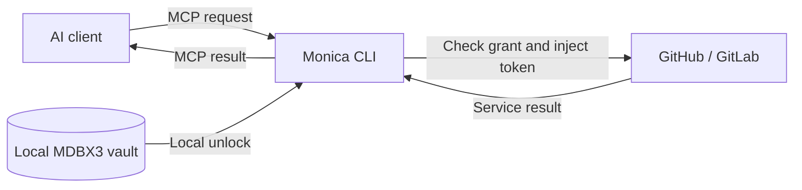

# Monica CLI

**English** · [简体中文](README.md)

[Implementation status](docs/redesign-progress.md) · [Source dependencies](docs/source-checkout.md) · [Token / Android format](docs/token-format.md)

**A local credential gateway that lets AI use services within the permissions you grant.**

Monica CLI stores service tokens in a local, encrypted MDBX3 vault. AI requests an operation through MCP; Monica checks the grant, injects the credential, sends the request, and returns the service result. You manage credentials and permissions, while AI uses connection names and purpose notes to understand which service to use without directly holding the raw token.

[Quick start](#quick-start) · [Connect an AI client](#connect-an-ai-client) · [WebDAV vaults](#webdav-vaults) · [Build from source](#build-from-source) · [GitHub](https://github.com/Monica-Pass/Monica-cli)


*Database and nested-category home rendered from synthetic test data. The interface supports English and Simplified Chinese.*

## What Monica does

| Feature | How it works |
| --- | --- |
| Local credential management | Encrypt tokens in MDBX3 and unlock them with a master password. Create connections in the TUI or from the command line. |
| Service access for AI | Connect MCP-compatible AI clients to GitHub and GitLab through the standard MCP stdio interface. |
| Calls by connection name | Give connections names such as `work-github` and public purpose notes. AI can discover their granted scope and call them by name. |
| Permission controls | Set the connection, repositories, allowed operations, expiry, and request limit. Grants are read-only by default and can be revoked. |
| Terminal manager | Browse a Yazi-style three-pane layout with Vim-style keys, filtering, detail previews, and a command browser. |
| CLI automation | Short aliases, explicit parameters, secure non-interactive input, and stable JSON results let AI perform local management operations. |
| Interface languages | Simplified Chinese and English across the TUI, forms, CLI help and human-facing messages, with automatic selection and saved preferences. |
| WebDAV vaults | Sign in to WebDAV, browse remote MDBX files, open local copies, and manually sync encrypted vaults. |

**The available service operations are listing, reading, and creating GitHub / GitLab Issues.** Both hosted services and manually configured HTTPS API endpoints for self-hosted installations are supported.



## Quick start

On Windows, build and run `./scripts/install.ps1 -InstallDir D:\Apps\MonicaCLI`. The installer adds `monica`, `monicapass`, and `monica-pass` to your user PATH. Open a new terminal, then run `monica`. Updating preserves the `data` directory; close Monica before updating.

The default home shows databases, nested categories, and entries:

1. Press `Enter` to create your first database, or `o` to open an MDBX file. Its password protects the encrypted database.
2. Press `Enter` to browse. Use `n` to create a category and `c` to save a service Token in the selected category.
3. Press `F3` to open settings when you need AI grants, MCP configuration, or WebDAV sync.

| Home action | Key |
| --- | --- |
| Choose database / create another | `d`, then `Enter` / `n` |
| Open category / parent | `Enter` / `h` or `Backspace` |
| Switch category tree and entries | `Tab` |
| New category / service Token | `n` / `c` |
| Rename category / replace Token | `e` |
| Move to another category | `m` |
| Open an MDBX file | `o` |
| Clear cached metadata and lock | `L` |
| Home / settings | `F3` |
| Language / quit | `F2` / `q` |

In edit forms, `Tab` moves between fields and `Ctrl+S` opens a separate database-password step. `Esc` in that step returns to the draft and clears the password. Each management operation unlocks the database only while it runs; summary metadata is cached for at most five minutes. This is separate from the AI broker's five-minute unlock session.

In settings, press `c` for guided service setup, or `a` to configure an explicit grant. Grants have **no expiry by default**, and remain revocable. Leave the expiry field blank (CLI: `--ttl 0`) for indefinite authorization, or enter 1–1440 minutes. An indefinite grant still requires an active unlocked broker. Token replacement revokes existing grants for that connection.

Use a UTF-8 terminal at least **70 columns × 20 rows**. Settings retain `/` filtering, `1`–`5` page navigation and `:` commands.

### Interface language

Monica includes **Simplified Chinese** and **English**. The first launch follows the system locale, with English as the fallback for unsupported languages.

Press `F2` in the TUI to switch and save, or enter `:lang en`, `:lang zh-CN` or `:lang auto`. Switching preserves your selection and form input.

```sh
monica-pass --lang en
monica-pass --lang zh-CN --help
monica-pass language en
monica-pass language auto
```

`--lang` applies to one run. The `language` command saves a preference; omit its argument to view the current setting. No vault creation or unlock is required. The preference is saved as `gateway.preferences.json` next to the configuration; a different `--config` filename uses its own preference file.

Precedence is: `--lang` → the `MONICA_LANG` environment variable → saved preference → system locale. Automatic mode checks `LC_ALL`, `LC_MESSAGES` and `LANG`; on Windows, it uses the system locale when those variables are unset.

Connection names and purpose notes are shown as entered. CLI JSON output, MCP tool names, arguments and error codes stay stable across interface languages.

### Start from the command line

You can also create a vault, add a connection, issue a grant, and unlock the gateway with one command:

```sh
monica-pass add work-github --repo your-org/your-repo --note "Track product issues and feature requests" --serve
```

Monica prompts for the token and master password using hidden input. `--serve` keeps the gateway running after setup. Without it, the command exits after saving the configuration; run `monica-pass serve` when you want to unlock the gateway.

For GitLab:

```sh
monica-pass add work-gitlab --provider gitlab --repo your-group/your-project --note "Handle Issues for the team project" --serve
```

Repeat `--repo` to grant access to multiple repositories. To allow Issue creation, explicitly add `--allow-write`, or press `a` in the TUI to create a suitable grant for an existing connection.

Common management commands:

```sh
monica-pass list
monica-pass note work-github "Track Issues in the documentation repository"
monica-pass serve
monica-pass lock
```

You can also use `init`, `connect`, and `grant` to create a vault, save a connection, and configure a grant separately. Run `monica-pass --help` or `monica-pass <subcommand> --help` for the available options.

### Short commands and names

Aliases are equivalent to the full commands. Common options also have short forms:

```sh
monica-pass a work-github -r your-org/your-repo -n "Track product issues" -s
monica-pass ls
monica-pass show work-github
monica-pass e work-github "Track documentation issues"
monica-pass m work-github
monica-pass ck work-github
```

| Action | Full command | Alias |
| --- | --- | --- |
| Quick add / save a connection | `add` / `connect` | `a` / `c` |
| List connections / edit purpose | `list` / `note` | `ls` / `e` |
| Create / open a local vault | `init` / `open` | `n` / `o` |
| Issue / revoke a grant | `grant` / `revoke` | `g` / `rv` |
| Unlock and serve / lock | `serve` / `lock` | `u` / `lk` |
| MCP settings / check discovery | `settings` / `check` | `m` / `ck` |
| Status / WebDAV / command discovery | `status` / `webdav` / `commands` | `st` / `dav` / `cmds` |

Use `-r` for a repository, `-p` for the provider, `-n` for a purpose note, `-t` for grant lifetime, and `-s` to serve after adding. Global `-C` selects the configuration file and `-l` selects the language. TUI keys remain as shown in its footer.

`show` selects a connection name and displays its public purpose and grants. `m` and `ck` select a grant name; quick add uses the same name for both. Management that accesses the vault, including sync, first stops the broker and drains in-flight requests. It leaves the broker locked; run `u`, or press `u` in the TUI, to resume MCP access. Metadata queries and revocation do not stop the broker.

### AI management through the CLI

Vault creation, opening, connection creation, purpose edits, grants, revocation, WebDAV, and broker management all have CLI entry points. AI can discover parameters and operate by name:

```sh
monica-pass cmds --json
monica-pass cmds add --json
monica-pass ls --json
monica-pass show work-github --json
monica-pass m work-github --json
```

`--json` (`-j`) returns `ok`, `command`, `data` or a fixed error code and disables prompts. Results do not depend on the interface language. `--non-interactive` disables prompts without changing the output format. With no subcommand, normal mode opens the TUI; JSON or non-interactive mode shows status.

Operations needing credentials accept `--secrets-stdin`. For example, AI can start this command while a **trusted local launcher** sends the `password` and `token` fields directly to its stdin:

```sh
monica-pass a work-github -r your-org/your-repo -n "Track product issues" --json --secrets-stdin
```

Secrets do not need to pass through the model, command arguments, environment variables, or output. Missing input returns `secret_input_required` and the required field names. See [CLI automation](docs/automation.en.md) for the input contract, launcher example, and operation mapping.

## Connect an AI client

Monica provides an **MCP stdio** service. Use the configuration generated by the program: quick add displays and saves it; press `m` on a selected grant or run `monica-pass m <grant-name>` to retrieve it again.

The following is a common JSON configuration format. Both paths are examples; use the paths generated by your Monica installation. For clients that use TOML or another format, configure the same `command` and `args`.

```json
{
  "mcpServers": {
    "monica-work": {
      "command": "C:/Tools/Monica/monica-pass.exe",
      "args": [
        "mcp",
        "--client",
        "C:/MonicaData/clients/agent-read.client.json"
      ]
    }
  }
}
```

Each grant binds to one connection. To use multiple connections, add their corresponding MCP server entries to your AI client. The AI client starts the MCP entry point; the human-operated TUI or `serve` terminal unlocks the gateway.

### Help AI understand a connection's purpose

AI can call `monica_list_connections` with `{}` to discover the connection covered by its grant: its name, provider, purpose note, repository scope, available tools, and expiry.

For example, name a connection `work-github` and give it the note “Track product issues and feature requests.” AI can use that context to choose the connection for a task. An MCP call to list Issues looks like this:

```json
{
  "name": "github_list_issues",
  "arguments": {
    "connection": "work-github"
  }
}
```

The `repository` argument can be omitted when the grant covers exactly one repository. With multiple repositories, it must be specified. Names and notes describe the purpose; the grant determines the actual permissions.

### Available service tools

| Operation | GitHub | GitLab |
| --- | --- | --- |
| List Issues | `github_list_issues` | `gitlab_list_issues` |
| Read an Issue | `github_get_issue` | `gitlab_get_issue` |
| Create an Issue | `github_create_issue` | `gitlab_create_issue` |

Reading an Issue requires `number`, which is the project-local Issue IID on GitLab. Creation requires explicit write permission, a `title`, and a UUID `request_id`. Reuse the same ID and arguments when retrying the same creation to avoid duplicates. If the result is `write_outcome_unknown`, check the remote repository before taking further action.

## WebDAV vaults

Sign in and manage WebDAV vaults directly from the TUI:

1. Press `i` and enter the WebDAV folder's **HTTPS URL, username, and password or app password**.
2. Browse the WebDAV list and press `Enter` to open an `.mdbx` file, then enter its master password. Monica creates a local encrypted copy, so later gateway use does not require an ongoing WebDAV connection.
3. Press `s` to manually sync the connected vault. If you are starting with a local vault, first press `P` to publish it under a new remote filename, then use `s` to sync.

The WebDAV password is held only for the current TUI session and is cleared on exit or `:logout`. The URL and username can be remembered. These operations are also available from the command line:

```sh
monica-pass webdav login --url https://dav.example.com/monica/ --username your-name
monica-pass webdav list
monica-pass webdav open vault.mdbx
monica-pass webdav sync
```

Each WebDAV network command needs a session password, supplied through hidden input or `--secrets-stdin` and cleared when the command exits. `monica-pass dav st` displays saved connection metadata without a password. Sync compares local and remote versions and reports a conflict if both have changed. You can publish the local version under a new filename before resolving the conflict. Opening a different vault preserves the previous local file and clears existing AI grants.

Supported vaults are password-unlocked, **self-contained MDBX files up to 64 MiB**. External `.blobs` attachments and incremental sync directories are not supported. Replacing a remote file requires strong ETags and conditional writes from the server; reading remains possible without them.

Some services, including the tested Jianguoyun endpoint, do not return strong ETags. Creating, reading, and downloading files still work; save later local changes under a new remote filename with `P` or `webdav publish NEW_NAME.mdbx`. The TUI preview and `safe_remote_replace: false` in `webdav status --json` make this limitation explicit. Monica does not force an overwrite.

MDBX3 is the runtime version; native vaults currently carry the `MDBX-2` format marker. Some older Android clients produced `MDBX-1` vaults with different encryption and unlock structures. These cannot be opened directly: Monica returns `vault_schema_unsupported` and preserves the original. Use a native MDBX3 vault; renaming the extension or changing the format marker does not convert a vault.

<details>
<summary>View the WebDAV sign-in screen</summary>


</details>

## Credentials and permissions

- **The local gateway manages credentials.** Tokens are encrypted in MDBX3. Master passwords and tokens use hidden input or a trusted process's stdin pipe. They are not accepted through command-line arguments or environment variables.
- **AI receives specific permissions.** Each grant limits the connection, exact repositories, operations, lifetime, and request rate. Grants are read-only by default; writes require explicit permission. Press `x` on the grants page or use `revoke` to revoke a grant.
- **Public metadata is separate from secrets.** Authorized AI clients can see connection names and purpose notes; do not put passwords or tokens in notes. Client grant files do not contain service tokens, but they still confer access and must be protected.
- **MCP exposes the supported service operations.** There are no tools for reading credentials, requesting arbitrary URLs, supplying arbitrary authorization headers, or executing shell commands. Service requests use HTTPS and do not follow redirects.
- **You control when the gateway is available.** Use `u` / `serve` to unlock and `L` / `lock` to lock. Exiting the terminal that unlocked the gateway stops its gateway process. Remote actions already sent cannot be undone.

This isolation applies to the MCP and gateway interfaces. A program running as the same OS user with arbitrary file modification or process debugging access is outside this boundary. Use separate OS accounts or a sandbox when stronger isolation is required. See [SECURITY.md](SECURITY.md) for details (in Chinese).

## Build from source

You need **Rust 1.97**, a native C toolchain, and the MDBX3 engine source. Cargo currently references the engine through sibling directories. Prepare this layout before building:

```text
workspace/
├── Monica-cli/                 # This repository
│   └── Cargo.toml
└── mdbx/                       # MDBX3 engine source
    └── crates/
        ├── mdbx-core/
        └── mdbx-storage/
```

Run in the repository directory:

```sh
cargo build --release --locked
```

Windows GNU builds require MinGW-w64 GCC. You can build with:

```sh
cargo +1.97.0-x86_64-pc-windows-gnu build --release --locked
```

The executable is written to `target/release/monica-pass`, or `target/release/monica-pass.exe` on Windows. Operation has been verified on Windows GNU; other platforms require building and validation in your environment.

## Data locations

Portable installations have an empty `monica-pass.portable` marker beside the executable. Configuration, vaults, and logs default to the adjacent `data/` directory. An installation on D: uses D: for its data regardless of the working directory.

Without the marker, Windows uses `%LOCALAPPDATA%/MonicaPass`. Unix uses `$XDG_STATE_HOME/monica-pass`, falling back to `~/.local/state/monica-pass` when that variable is unset.

`--config` takes precedence over these default locations. Use it for a separate configuration and vault, for example:

```sh
monica-pass --config C:/MonicaData/gateway.json
```

WebDAV sync transfers the encrypted vault. Local AI grant files and operation logs are not uploaded with it. See the [security guide](SECURITY.md#维护与恢复) for backup and recovery instructions (in Chinese).

## Further reading

- [Security boundaries, grants, and recovery](SECURITY.md) (Chinese)
- [TUI layout and interaction guide](docs/tui-design.md) (Chinese)
- [Third-party licenses and acknowledgments](THIRD_PARTY_NOTICES.md); the terminal interface draws on [Yazi](https://github.com/sxyazi/yazi).
- [Bug reports and feature requests](https://github.com/Monica-Pass/Monica-cli/issues)
