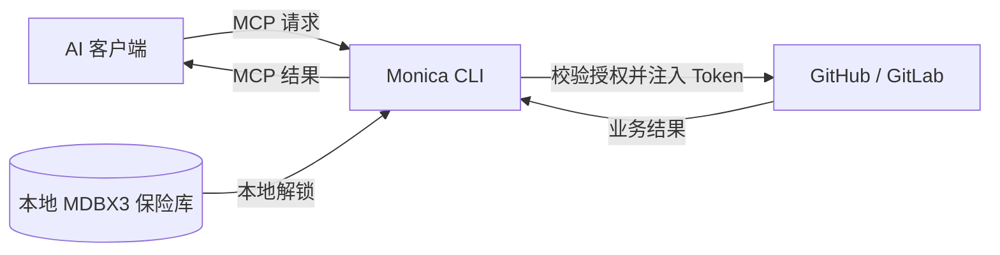

<h1 align="center">Monica CLI</h1>

<div align="center">

**简体中文** · [English](README.en.md)


<br/>


**Monica 的本地凭据代理端：让 AI 在你的授权范围内使用服务 Token。**

<p>日常密码管理在 Monica for Android，这一端只管 AI 与凭据之间的边界 · 服务 Token 留在本地 MDBX3 加密保险库 · 授权一律会到期 · 解锁与撤销由你执行</p>

<p>
隶属 <a href="https://github.com/Monica-Pass/Monica"><strong>Monica 本地密码库</strong></a> 生态 ·
<a href="https://monica-pass.github.io/MonicaDocs/">Monica 文档站</a>
</p>

[](https://github.com/Monica-Pass/Monica)
[](https://github.com/Monica-Pass/Monica/releases)
[](docs/redesign-progress.md)
[](#从源码构建)
[](#从源码构建)
<br>
[](https://afdian.com/a/JoyinJoester)
[](https://ko-fi.com/joyinjoester)
[](https://www.paypal.com/ncp/payment/BHSYWK73CA8FW)
[](https://liberapay.com/JoyinJoester)
[](https://qm.qq.com/q/2vTdTkHV3u)
[](https://t.me/+IZUDLL-vWOA1Y2U1)

</div>

[实现与验证](docs/redesign-progress.md) · [克隆与构建依赖](docs/source-checkout.md) · [Token 与 Android 数据约定](docs/token-format.md)

Monica CLI 将服务 Token 保存在本地 MDBX3 加密保险库中。AI 通过 MCP 请求操作，Monica 校验授权、注入凭据并代为发送请求，再将业务结果返回给 AI。你负责管理凭据和权限，AI 通过连接名称和用途备注理解该使用哪个服务，无需直接持有原始 Token。

[它是什么](#先说清楚它是什么) · [快速开始](#快速开始) · [接入 AI](#接入-ai) · [WebDAV 保险库](#webdav-保险库) · [从源码构建](#从源码构建) · [Monica 主仓库](https://github.com/Monica-Pass/Monica) · [本仓库](https://github.com/Monica-Pass/Monica-cli)


*数据库与嵌套分类主页；由合成测试数据渲染。*

## 先说清楚它是什么

**Monica 是密码管理器，Monica CLI 不是。** 日常管账号、密码、2FA 的是 [Monica for Android](https://github.com/Monica-Pass/Monica)，那边有 TOTP、自动填充、卡片与身份条目、浏览器联动。本工具只做一件事：**站在 AI 和远端服务之间，替你保管并授权使用服务 Token。**

具体一点：

- **它管的是"要交给 AI 去办事"的那批凭据**，例如 GitHub / GitLab 的 API Token，不是你全部的密码。
- **它把 Token 挡在 AI 之外**：AI 只能提出"列出这个仓库的 Issue"这样的请求；校验授权、注入凭据、发送请求、检查响应是否回泄都由本地代理完成，原始 Token 从不出现在模型上下文里。
- **它给权限上了时间**：每一份 AI 授权都会到期、可以设调用次数上限、只能由人在本地 `refresh` 续期，**不存在永久授权**；而存在保险库里的凭据本身不过期，也不会因为授权到期被删。
- **它可以让每次写入先问你一句**：授权设 `--approval write` 后写操作、设 `--approval all` 后每一次调用，都要等你本人在终端里按 `y` 才会发出，最多等 15 秒，没人应答就返回 `approval_timeout`。提示只出现在你自己的终端（TUI 弹窗或 `serve` 终端），AI 侧没有应答通道也读不到它，`monica approve` 这样的命令**故意不存在**；被拒的调用不消耗次数预算。
- **它顺带能管理这份数据库**：内置 TUI 与命令行，是因为配授权、看状态、同步 WebDAV 不必为此打开手机。

它和手机 Monica **读写同一份 MDBX3 数据库**，所以是同一个保险库的两个入口，不是两套互不相干的存储。它明确不做的部分：不生成 TOTP、不做自动填充、没有浏览器扩展、不导入 KeePass / Bitwarden、不处理外置附件（带 `.blobs` 的库会被直接拒绝，报 `external_blobs_unsupported`）。

> 想要"一个 App 管我所有密码"——那是[主仓库](https://github.com/Monica-Pass/Monica)。想要"让 AI 帮我建 Issue、查 PR，但别想把我的 Token 拿走"——就是这个仓库。

## Monica 生态

Monica 是聚合 **Bitwarden** 与 **KeePass** 的本地优先密码库，本仓库是它的命令行与 AI 网关一端，与手机端读写同一份 MDBX3 数据库。

| 组件 | 用途 | 入口 |
| --- | --- | --- |
| Monica for Android | 手机端日常使用：本地 Vault、TOTP、自动填充、WebDAV 同步 | [主仓库](https://github.com/Monica-Pass/Monica) · [Releases](https://github.com/Monica-Pass/Monica/releases) |
| Monica CLI（本仓库） | 本地凭据代理：人工管理 + 让 AI 在授权范围内使用服务 | 当前目录 |
| Monica 文档站 | 面向使用者的完整文档 | [MonicaDocs](https://monica-pass.github.io/MonicaDocs/) |

手机与命令行共用同一份数据库：在 CLI 里建库、保存 Token、同步 WebDAV 之后，手机 Monica 打开同一个 `.mdbx` 文件就能看到并继续编辑同一批条目；根分类与密钥条目的跨端约定见 [WebDAV 保险库](#webdav-保险库)。

> 整个项目目前由一人维护，优先级依次是 Android 端的功能与稳定性、CLI 端的授权边界、文档。感谢理解与支持。

## 能做什么

| 能力 | 使用方式 |
| --- | --- |
| 本地凭据管理 | 使用 MDBX3 加密保存 Token，通过主密码解锁；支持在 TUI 或命令行创建连接。 |
| AI 服务接入 | 提供标准 MCP stdio 接口，供支持 MCP 的 AI 客户端调用 GitHub、GitLab。 |
| 按名称调用 | 为连接设置 `work-github` 等名称和公开用途，AI 可发现授权范围并按名称使用。 |
| 精确授权 | 指定连接、仓库、允许操作、有效期、每分钟限额和总调用次数；默认只读，可随时撤销，且不存在永久授权。 |
| 终端管理页面 | Yazi 风格的三栏布局，配合 Vim 式按键、模糊搜索、详情预览、公开字段一键复制和命令浏览。 |
| 命令行自动化 | 常用命令有缩写；AI 可用明确参数、非交互凭据输入和稳定 JSON 结果完成管理操作。 |
| 多语言界面 | 简体中文和 English，覆盖 TUI、表单、CLI 帮助和人工提示；自动选择语言，也可手动切换并保存。 |
| WebDAV 保险库 | 登录 WebDAV、浏览远端 MDBX 文件、打开本地副本，并手动同步加密保险库。 |
| SSH / GPG 密钥条目 | 在同一份加密保险库里保存 SSH 私钥与 OpenPGP 证书，存储格式与 Monica for Android 一致；可生成 Ed25519 与 RSA、导入 PEM 与 armor、显式导出到文件。AI 侧完全看不到这些条目。 |

**支持 GitHub / GitLab 通用 API 代理，以及按仓库限制的 Issue 工具。** 完整服务授权后，分支、提交、MR/PR、评论、流水线等接口无需修改 Monica 即可调用；详见[通用 API 使用说明](docs/service-api.md)。 支持官方服务，也支持人工配置自托管服务的 HTTPS API 地址。



## 快速开始

Windows 先按[从源码构建](#从源码构建)产出 `target/release/monica-pass.exe`，再运行 `./scripts/install.ps1 -InstallDir D:\Apps\MonicaCLI`。安装器默认取用该构建产物，也可用 `-Source` 指定其他可执行文件；`-InstallDir` 必须是绝对路径且不能是盘根目录，目标目录非空时必须已是一次 Monica 便携安装，更新前请先退出正在运行的 Monica。安装会写入 `monica-pass.exe` 以及 `monica`、`monicapass` 两个入口并加入用户 PATH，配置、保险库和日志保存在同目录的 `data/`。打开新终端后输入 `monica` 即可启动。安装副本不会随仓库更新；如果 `monica refresh` 之类的较新命令被报为未知命令，说明副本落后于源码，需要重新构建并安装。

默认主页按数据库、嵌套分类和条目组织内容：

1. 首次按 `Enter` 创建数据库，或按 `o` 打开 MDBX 文件。数据库密码用于保护其中的加密内容。
2. 按 `Enter` 解锁查看；用 `n` 创建分类，用 `c` 在当前分类保存服务 Token。
3. 需要配置 AI 授权、MCP 或 WebDAV 同步时，按 `F3` 打开设置。

未解锁时，中栏列出的不是提示文字，而是可执行的操作行（打开数据库、打开本地 MDBX、新建数据库），用 `Enter` 执行其中一行。

| 主页操作 | 按键 |
| --- | --- |
| 数据库栏：选择 / 切换 / 新建 | `d` 后 `j`/`k`，再 `Enter` / `n` |
| 列表移动 / 首尾 / 翻页 | `j`/`k` / `g`/`G` / `PgUp`/`PgDn` |
| 打开分类 / 返回上一级 | `Enter` / `h`、`Backspace` 或 `Left` |
| 在数据库、列表、详情三栏间切换 | `Tab` / `Shift+Tab` |
| 全库搜索分类与条目（子序列匹配） | `/` |
| 新建分类 / 服务 Token | `n` / `c` |
| 新建 SSH 密钥 / 导入私钥 / 导入 OpenPGP | `S` / `I` / `A` |
| 复制公钥行或用户 ID / 复制指纹（仅密钥行） | `y` / `Y` |
| 重命名分类 / 更换 Token | `e` |
| 移动到其他分类 | `m` |
| 删除所选行（键回名称确认，分类必须先清空） | `D` |
| 打开 MDBX 文件 | `o` |
| 帮助 / 上一条消息 / 命令（如 `:lock`） | `?` / `!` / `:` |
| 主页 / 设置 | `F3` 或 `,` |
| 切换语言 / 退出 | `F2` / `q` |

`/` 是子序列匹配并按相关度排序：`sk` 就能找到 `ssh-key`，空格仍然逐词收窄，最像的一条始终排在最前。`y` / `Y` 只写入密钥条目的公开字段（公钥行、用户 ID、指纹），Token 与私钥材料不进剪贴板，命令行也不写剪贴板。`D` 删除所选行：确认表单里的名称必须自己键回，空的预填不会替你按下删除；绑定了连接的凭据按连接删除（其授权一并撤销），非空分类只会告你还剩多少条目与子分类。

编辑表单用 `Tab` 切换字段，`Ctrl+S` 进入独立的数据库密码步骤。在密码步骤按 `Esc` 返回草稿并清除密码。每次管理操作只在执行期间解锁数据库，条目摘要最多缓存五分钟；这与 AI 代理的五分钟解锁会话相互独立。

设置中按 `c` 可引导式接入服务，按 `a` 单独配置授权。授权**一律会到期**，可随时撤销：有效期默认 240 分钟（命令行 `--ttl`，可指定 1–1440 分钟，留空不再表示永久），还可以用 `--max-calls` 限制该授权能发起的上游请求次数。窗口或次数用尽后，AI 侧只会收到 `reauthorization_required`，必须由人在本地执行 `monica refresh 授权名` 续期（暂仅在命令行提供，TUI 无对应按键），续期会换发新的 capability，需重启 MCP 客户端才会生效。任何授权仍需要代理处于解锁状态。更换 Token 后，该连接原有授权会被撤销。

授权还可以设**人工门槛**：命令行 `monica grant … --approval write`（写操作先问你）或 `--approval all`（每次调用都问），续期用 `monica rf 授权名 --approval all` 补设，`off` 为默认即不询问；TUI 的授权表单里对应「人工批准」一栏。`add` 这条快速路径没有该参数，它签出的授权一律是 `off`，需要门槛就事后用 `grant`/`rf` 补设。`st` 的表格新增「门槛」一列（英文界面为 `Gate`）直接显示档位。详见 [docs/human-guide.md](docs/human-guide.md) 第 6.5 节。

主页树里始终有一行 **AI 授权**（锁库时也在），行尾直接给出当前生效的授权数量，按 `Enter` 进入授权列表：仍在生效的行显示只读或读写，已过期与 **调用已用完** 的行转暗，选中行的预览给出 `已用/上限` 次数——不用打开详细数据库就能看清哪些代理还在服务。

建议使用至少 **70 列 × 20 行**的 UTF-8 终端。设置页面保留 `/` 筛选、`1`–`5` 切页和 `:` 命令入口。

### 界面语言

内置 **简体中文** 和 **English**。首次运行根据系统语言自动选择，暂不支持的语言回落到 English。

在 TUI 按 `F2` 即可切换并保存，也可以输入 `:lang en`、`:lang zh-CN` 或 `:lang auto`。切换时保留当前选择及表单输入。

```sh
monica-pass --lang en
monica-pass --lang zh-CN --help
monica-pass language en
monica-pass language auto
```

`--lang` 只影响本次运行；`language` 命令保存偏好，省略语言参数可查看当前设置。无需先创建或解锁保险库。偏好保存在配置文件旁的 `gateway.preferences.json` 中；指定其他 `--config` 文件名时会使用对应的偏好文件。

选择优先级为：`--lang` → `MONICA_LANG` 环境变量 → 已保存偏好 → 系统语言。自动模式识别 `LC_ALL`、`LC_MESSAGES`、`LANG`；Windows 未设置这些变量时使用系统区域语言。

连接名称和用途备注按原文显示。CLI 的 JSON 输出、MCP 工具名、参数与错误码保持固定，AI 接入方式与界面语言无关。

连接名称是 ASCII 句柄（`[A-Za-z0-9_-]`），授权、MCP 配置与命令参数都按它引用。条目可以另有一个可选的显示标题（`--title`，支持中文，≤256 UTF-8 字节），仅用于保险库列表展示，留空则等于句柄；已建条目用 `rename-entry <句柄> <新标题>` 改名，TUI 选中条目按 `r`。改名只动显示标题，加密载荷与 AI 授权不受影响，AI 始终按句柄使用连接。

### 从命令行开始

也可以用一条命令完成建库、添加连接、授权和解锁：

```sh
monica-pass add work-github --repo your-org/your-repo --note "跟踪产品问题与功能建议" --serve
```

程序会隐藏询问 Token 和主密码。`--serve` 表示保存后继续运行代理；省略它则完成配置后退出，需要使用时再运行 `monica-pass serve`。

GitLab 示例：

```sh
monica-pass add work-gitlab --provider gitlab --repo your-group/your-project --note "处理团队项目的 Issue" --serve
```

需要多个仓库时重复指定 `--repo`。需要允许创建 Issue 时，显式添加 `--allow-write`，或在 TUI 用 `a` 为已有连接创建相应授权。

常用管理命令：

```sh
monica-pass list
monica-pass note work-github "跟踪文档仓库的 Issue"
monica-pass serve
monica-pass lock
```

`init`、`connect`、`grant` 也支持分别创建保险库、保存连接、配置授权。使用 `monica-pass --help` 或 `monica-pass <子命令> --help` 查看参数。

删除按目标分三条命令：`delete <连接名>` 移除连接、它绑定的凭据与该连接下的全部授权；`delete <条目ID>` 移除一条不属于任何连接的条目；`delete-category <分类ID>`（`rmdir`）只移除空分类，分类里还有条目或子分类时直接拒绝并报出数量。手机 Monica 存新条目的那个根分类删不掉也挪不走（`protected_collection`），删掉它这份库在手机侧就变回只读。密钥条目用 `keys delete <名称>`。

```sh
monica-pass library                       # 取条目与分类 ID
monica-pass delete work-github            # 需键回 work-github 确认
monica-pass delete-category 3f2a…-id      # 分类必须已经是空的
monica-pass keys delete 工作机 --force
```

在人工终端里执行时必须把目标名**原样键回**一遍才动手；`--force` 是核对过目标之后的跳过方式。通过 `--secrets-stdin` 注入凭据的脚本没有可问的人，缺少 `--force` 就得到 `confirmation_required`——沉默永远不会被当作同意。删除写入的是墓碑标记：所有列表与 AI 侧都不再看到这一行，墓碑会随分段同步传到其他设备，而密文本身仍留在数据库文件里（引擎暂无清除路径），已经导出到磁盘的密钥文本也不会被收回。当前没有撤销删除的命令，回退方式是[第 8 节的备份恢复](docs/human-guide.md#8-备份与恢复)。

### 短命令与按名称操作

完整命令与缩写等价，常用参数也支持短写：

```sh
monica-pass a work-github -r your-org/your-repo -n "跟踪产品问题" -s
monica-pass ls
monica-pass show work-github
monica-pass e work-github "跟踪文档仓库的问题"
monica-pass m work-github
monica-pass ck work-github
```

| 操作 | 完整命令 | 缩写 |
| --- | --- | --- |
| 快速添加 / 仅保存连接 | `add` / `connect` | `a` / `c` |
| 列出连接 / 编辑用途 | `list` / `note` | `ls` / `e` |
| 建库 / 打开本地库 | `init` / `open` | `n` / `o` |
| 创建授权 / 续期 / 撤销授权 | `grant` / `refresh` / `revoke` | `g` / `rf` / `rv` |
| 给授权设人工门槛 | `grant --approval off\|write\|all` / `refresh --approval <档位>` | 授权表单「人工批准」栏 |
| 解锁并运行 / 锁定 | `serve` / `lock` | `u` / `lk` |
| MCP 配置 / 检查工具 | `settings` / `check` | `m` / `ck` |
| 状态 / WebDAV / 命令查询 | `status` / `webdav` / `commands` | `st` / `dav` / `cmds` |
| 删除连接或条目 / 删除空分类 | `delete` / `delete-category` | `rm`、`del` / `rmdir` |

`audit` 读取本地 AI 调用审计（`--grant <授权名>` 过滤、`--limit <条数>` 取最近若干条，新的在前），不需要主密码，也不含任何凭据内容。

`-r` 是仓库，`-p` 是服务类型，`-n` 是用途备注，`-t` 是授权分钟数，`-s` 表示添加后运行代理。人工门槛是 `--approval off|write|all`，只有长写法、没有缩写。全局 `-C` 指定配置文件，`-l` 指定界面语言。TUI 的按键仍按页面底部提示使用。

`show` 按连接名称显示用途和相关授权；`m`、`ck` 按授权名称操作，快速添加时二者名称相同。需要访问保险库的管理或同步会先停止代理并等待在途请求结束，完成后保持锁定；需要继续使用 MCP 时运行 `u`，或在 TUI 按 `u`。查询元数据和撤销授权无需停止代理。

### AI 通过 CLI 管理

TUI 中的建库、打开库、添加连接、编辑用途、授权、撤权、WebDAV 和代理管理都有 CLI 入口。AI 可以先查询命令，再按名称操作：

```sh
monica-pass cmds --json
monica-pass cmds add --json
monica-pass ls --json
monica-pass show work-github --json
monica-pass m work-github --json
```

`--json`（`-j`）统一输出 `ok`、`command`、`data` 或固定错误码，并禁用交互提示；结果不随界面语言变化。`--non-interactive` 也可单独用于禁止提示。无子命令时，普通模式打开 TUI，JSON / 非交互模式查询状态。

不带 `--json` 时，`databases` / `library` / `webdav list` 输出随界面语言翻译表头的对齐表格，每行都带下一步要用的 ID；写命令只回一行确认。JSON 结构不随这些变化改变，脚本一律用 `--json`。

需要凭据的操作使用 `--secrets-stdin`。例如，AI 可以发起以下命令，由**可信本地启动器**把 `password` 和 `token` 两个字段直接送入该进程的标准输入：

```sh
monica-pass a work-github -r your-org/your-repo -n "跟踪产品问题" --json --secrets-stdin
```

密码和 Token 不需要经过模型，也不放进命令参数、环境变量或输出。缺少安全输入时返回 `secret_input_required` 和所需字段。管道接入示例、输入格式和完整操作对应表见 [CLI 自动化说明](docs/automation.md)。

## 接入 AI

Monica 提供 **MCP stdio** 服务。优先使用程序生成的 MCP 配置：快速创建后会显示并保存配置，也可在授权页选中授权后按 `m`，或执行 `monica-pass m <授权名称>` 获取。

下面是常见的 JSON 配置形式。两个路径都是示例，请以 Monica 实际生成的路径为准；使用 TOML 等格式的客户端，填写相同的 `command` 和 `args` 即可。

```json
{
  "mcpServers": {
    "monica-work": {
      "command": "C:/Tools/Monica/monica-pass.exe",
      "args": [
        "mcp",
        "--client",
        "C:/MonicaData/clients/agent-read.client.json"
      ]
    }
  }
}
```

每份授权绑定一个连接。需要同时使用多个连接时，在 AI 客户端中添加对应的多个 MCP 服务器条目。MCP 客户端负责启动调用入口，人工 TUI 或 `serve` 终端负责解锁代理。

不想手工粘贴时，一条命令可以把这一条合并进客户端自己的配置文件——先备份、只动这一个条目、结构读不回来的文件直接不碰：

```sh
monica-pass settings <授权名> --install claude   # 或 cursor / codex / vscode
```

Claude Desktop 与项目级配置文件仍走上面的手工粘贴。行为边界与被写文件的位置见 [人工手册](docs/human-guide.md)第 4 节。

给 AI 的行为约束也有一份现成的：把 [docs/agent-policies/AGENTS.md](docs/agent-policies/AGENTS.md) 拷进客户端读取的规则文件（`CLAUDE.md`、项目 `AGENTS.md`、Cursor rules、Copilot instructions），就不用每次口头交代。

### 让 AI 知道连接的用途

AI 可先调用 `monica_list_connections`，参数为 `{}`，获取当前授权连接的名称、服务、用途备注、仓库范围、可用工具，以及这份 AI 授权的到期时间（保存在保险库里的令牌本身不会过期）。

例如，你将连接命名为 `work-github`，备注写为“跟踪产品问题与功能建议”，AI 就可以根据任务选择这份连接。一次列出 Issue 的 MCP 调用如下：

```json
{
  "name": "github_list_issues",
  "arguments": {
    "connection": "work-github"
  }
}
```

只有一个授权仓库时可省略 `repository`；授权包含多个仓库时必须明确指定。连接名称和备注帮助 AI 理解用途，实际权限始终由授权决定。

### 可用服务工具

| 操作 | GitHub | GitLab |
| --- | --- | --- |
| 列出 Issue | `github_list_issues` | `gitlab_list_issues` |
| 读取 Issue | `github_get_issue` | `gitlab_get_issue` |
| 创建 Issue | `github_create_issue` | `gitlab_create_issue` |
| 服务 API 读取 | `github_api_read` | `gitlab_api_read` |
| 服务 API 写入 / GraphQL | `github_api_write` | `gitlab_api_write` |

读取详情需要 `number`，GitLab 对应项目内的 Issue IID。创建需要明确的写权限，并提供 `title` 和 UUID 格式的 `request_id`；重试同一次创建时复用相同的 ID 和参数，避免重复创建。若返回 `write_outcome_unknown`，先核对远端结果。

## WebDAV 保险库

在 TUI 中就能完成 WebDAV 登录和保险库管理：

1. 按 `i`，填写 WebDAV 文件夹的 **HTTPS 地址、用户名、密码或应用密码**（密码只需填这一次）。
2. 在 WebDAV 列表中浏览目录，按 `Enter` 打开 `.mdbx` 文件，再输入保险库主密码。Monica 会建立本地加密副本，之后的网关使用不依赖 WebDAV 持续在线。
3. 按 `s` 手动同步已连接的保险库。如果从本地保险库开始，先按 `P` 将其发布到一个新的远端文件名，再使用 `s` 同步。

WebDAV 密码只需输入一次：验证成功后它保存在**本机凭据存储**里（Windows 凭据管理器、macOS 钥匙串、Linux Secret Service，密码不进启动参数），之后打开、同步只问保险库主密码，不再问 WebDAV 密码。地址和用户名照常保存，`:logout` 只结束本次会话、不会忘记已存的密码；要清除它用 `webdav forget-password`。命令行同样支持这些操作：

```sh
monica-pass webdav login --url https://dav.example.com/monica/ --username your-name
monica-pass webdav list
monica-pass webdav open vault.mdbx
monica-pass webdav sync
monica-pass webdav forget-password
```

命令行人工输入密码时同样走本机凭据管理器；`--secrets-stdin` 注入的密码**只在该进程内使用，一律不落盘**。`monica-pass dav st` 不联网即可查看连接信息和「已存密码」状态。整文件同步比较本地与远端版本，双方都有变化时报告冲突；可将本地版本发布到新文件名后再处理。打开另一份保险库会保留原本地文件，并清除现有 AI 授权。

支持通过密码解锁、**不超过 64 MiB 的自包含 MDBX 文件**，不支持外置附件 `.blobs`。远端有两种形态：目录里只有单个 `.mdbx` 文件时按整文件同步，覆盖远端需要服务器支持强 ETag 与条件写入，不支持时仍可读取；存在同名加 `.sync` 的文件夹（Monica Android 的写法）时自动改用分段流合并，双方都有变化由引擎按提交合并，每台设备只写自己名下的不可变分段，一次性发布的初始副本永不覆盖，该模式也不依赖强 ETag——每个分段写完都会读回核对摘要。重放时每个分段出一行进度，`Ctrl+C` 在分段边界停下（游标已落盘，下次从原位继续），再按一次立即退出。

整文件模式下，部分服务（如本次验证的坚果云）不返回强 ETag。此时可新建上传、读取和下载，但有本地改动后需按 `P` 或使用 `webdav publish NEW_NAME.mdbx` 保存为新的远端文件。`webdav status --json` 的 `safe_remote_replace: false` 和 TUI 预览会明确提示，程序不会强制覆盖。

MDBX3 指运行库版本，当前原生文件格式标记为 `MDBX-2`。部分旧 Android 客户端生成的 `MDBX-1` 使用另一套加密和解锁结构，无法直接打开；程序会返回 `vault_schema_unsupported`，保留原文件。此时应使用原生 MDBX3 保险库，不能仅修改扩展名或格式标记。

手机 Monica 写入前会按数据库 ID 派生出根分类的固定 ID（`nameUUIDFromBytes("monica-root:" + 数据库 ID)`，version-3）并在那里落条目；读取不需要这一行，写入需要。本工具建库时即写入这一行，打开旧版本建的库时也会在一次解锁动作里补写或按原 ID 恢复，**已有库不需要重建、不需要重新同步**就能在手机上正常新增条目。这一行在 `library` 里显示为标题 `Monica`，可放条目、可改名，但不允许删除或移入其他分类。Android 端把它显示成什么标题、以及手机上「未知版本（版本 0）」提示读的是哪个字段，本仓库未做实测。

<details>
<summary>查看 WebDAV 登录界面</summary>


</details>

## 凭据与授权

- **凭据由本地网关管理。** Token 加密保存在 MDBX3 中，主密码和 Token 使用隐藏输入或可信进程的标准输入管道，不通过命令参数或环境变量传入。
- **AI 只获得指定权限。** 每份授权限定连接、精确仓库、操作、有效期和请求限额；默认只读，写入必须明确允许。可在授权页按 `x` 或使用 `revoke` 撤销。
- **公开信息与秘密分开。** 名称和用途备注对获授权的 AI 可见，备注中不要填写密码或 Token。客户端授权文件虽不含服务 Token，仍代表访问权限，应妥善保护。
- **MCP 只提供已支持的服务操作。** 没有凭据读取、任意 URL 请求、任意授权头或 Shell 执行工具。对服务的请求使用 HTTPS，拒绝重定向。
- **密钥条目只由人管理。** SSH / GPG 密钥与 Token 存在同一份加密保险库里，格式与 Monica for Android 一致，同步后两端通用。生成、导入、编辑、导出都走 `monica keys` 一族命令或 TUI 的 `S` / `I` / `A`；这些命令不在 AI 可见的命令发现面里，密钥条目也不进 catalog 与 MCP 工具面。写出密钥文本的唯一途径是人显式执行的 `monica keys export`，公钥默认只出公钥，私钥需要 `--private`，已存在的文件不会被覆盖。
- **你控制代理何时可用。** `u` / `serve` 解锁，`L` / `lock` 锁定。退出负责解锁的终端会停止其代理；已经发出的远端操作无法撤回。

这里的隔离针对 MCP 和网关接口。同一系统用户下，拥有任意文件修改或进程调试权限的程序不受这一接口边界保护；需要更强隔离时，应使用独立系统账户或沙箱。详细说明见 [SECURITY.md](SECURITY.md)。

## 从源码构建

需要 **Rust 1.97**、本地 C 编译工具链，以及 MDBX3 引擎源码。当前 Cargo 依赖通过相邻目录引用引擎，构建前请准备以下结构：

```text
workspace/
├── Monica-cli/                 # 本仓库
│   └── Cargo.toml
└── mdbx/                       # MDBX3 引擎源码
    └── crates/
        ├── mdbx-core/
        └── mdbx-storage/
```

在仓库目录中执行：

```sh
cargo build --release --locked
```

Windows GNU 环境需要 MinGW-w64 GCC，并可使用：

```sh
cargo +1.97.0-x86_64-pc-windows-gnu build --release --locked
```

构建产物为 `target/release/monica-pass`，Windows 为 `target/release/monica-pass.exe`。目前已在 Windows GNU 环境验证运行；其他平台需要自行构建验证。

## 数据保存位置

便携安装时，可执行文件旁有一个空的 `monica-pass.portable` 标记文件，配置、保险库及日志默认保存在同目录的 `data/`。安装在 D 盘后，直接启动也使用 D 盘，不受当前工作目录影响。

没有便携标记时，Windows 使用 `%LOCALAPPDATA%/MonicaPass`；Unix 使用 `$XDG_STATE_HOME/monica-pass`，未设置时为 `~/.local/state/monica-pass`。

`--config` 优先于上述默认位置，可用于独立的配置和保险库，例如：

```sh
monica-pass --config C:/MonicaData/gateway.json
```

WebDAV 同步加密保险库，本地的 AI 授权文件和操作日志不会随之上传。备份与恢复方式见[安全文档](SECURITY.md#维护与恢复)。

## 更多资料

- [人工使用手册](docs/human-guide.md)：建库、授权、接入 AI 的完整流程与故障对照表。
- [命令练习本](docs/reference/index.html)：全部命令、真实输出，外加在浏览器里练手敲的练习模式；只按同一份语法校验，不执行任何命令。本地双击即可打开。
- [给 AI 的使用说明](docs/ai-guide.md)：可整段粘贴进项目规则的 AI 侧规范，含全部错误码对应的动作。
- [CLI 自动化](docs/automation.md)：`--secrets-stdin` 协议与稳定 JSON 结果约定。
- [通用服务 API 代理](docs/service-api.md)：`api_read` / `api_write` 的请求格式与限制。
- [安全边界、授权与恢复](SECURITY.md)
- [TUI 布局与交互说明](docs/tui-design.md)
- [第三方许可与致谢](THIRD_PARTY_NOTICES.md)；终端界面参考了 [Yazi](https://github.com/sxyazi/yazi)。
- [问题反馈与功能建议](https://github.com/Monica-Pass/Monica-cli/issues)；生态层面的问题请提到 [Monica 主仓库](https://github.com/Monica-Pass/Monica/issues)。

---

## 赞助支持

如果 Monica CLI 帮你把 Token 留在了自己手里，欢迎支持持续开发与维护。

<div align="center">

<br/>
<sub>微信 / 支付宝扫码支持</sub>
</div>

<br/>

<p align="center">
  <a href="https://afdian.com/a/JoyinJoester">
    
  </a>
  <a href="https://ko-fi.com/joyinjoester">
    
  </a>
  <a href="https://www.paypal.com/ncp/payment/BHSYWK73CA8FW">
    
  </a>
  <a href="https://liberapay.com/JoyinJoester">
    
  </a>
</p>

你的支持会优先用于：

- 授权边界与安全审计：让 Token 更不可能从这条接口泄漏。
- 跨端兼容：与手机 Monica 共用同一份数据库的持续对齐。
- 文档与人工体验：命令行、TUI 与[人工使用手册](docs/human-guide.md)的维护。

打赏鸣谢名单由 [Monica 主仓库](https://github.com/Monica-Pass/Monica#赞助支持) 的 README 统一维护——本仓库没有定时抓取爱发电的脚本，复制一份名单只会过期。

## 社区与支持

Monica 全项目共用同一个社区，CLI 的使用问题也欢迎在这里问：

- Telegram 群组：[加入 Monica 社区](https://t.me/+IZUDLL-vWOA1Y2U1)
- QQ 群：`1087865010`（[加群链接](https://qm.qq.com/q/2vTdTkHV3u)）
- 本仓库 [Issues](https://github.com/Monica-Pass/Monica-cli/issues) · 主仓库 [Issues](https://github.com/Monica-Pass/Monica/issues)

## 致谢

- [Monica for Android](https://github.com/Monica-Pass/Monica) — 与本工具读写同一份数据库的对端。
- [Yazi](https://github.com/sxyazi/yazi) — 终端界面布局与交互的参考。
- [Bitwarden](https://bitwarden.com/) 与 [KeePass](https://keepass.info/) — 本地优先密码管理生态的参照。
- 依赖与资源的许可声明见 [THIRD_PARTY_NOTICES.md](THIRD_PARTY_NOTICES.md)。

## 许可证

本仓库与 [Monica 主仓库](https://github.com/Monica-Pass/Monica) 使用同一份许可：**GNU General Public License v3.0**，全文见 [LICENSE](LICENSE)，`Cargo.toml` 中声明为 `GPL-3.0-only`。第三方组件与资源继续按其原有许可生效。

品牌名称与 Logo 的商标权归各自权利人所有。
