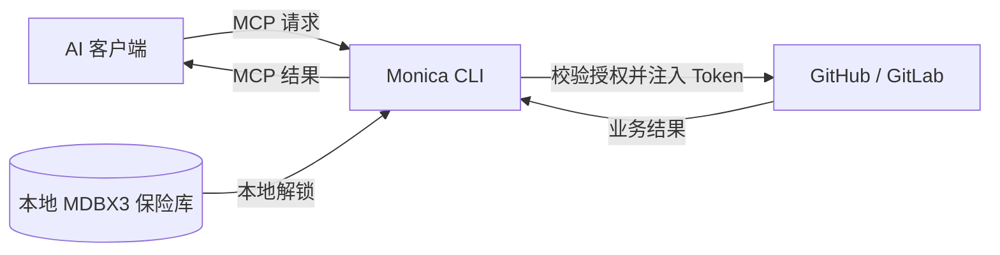
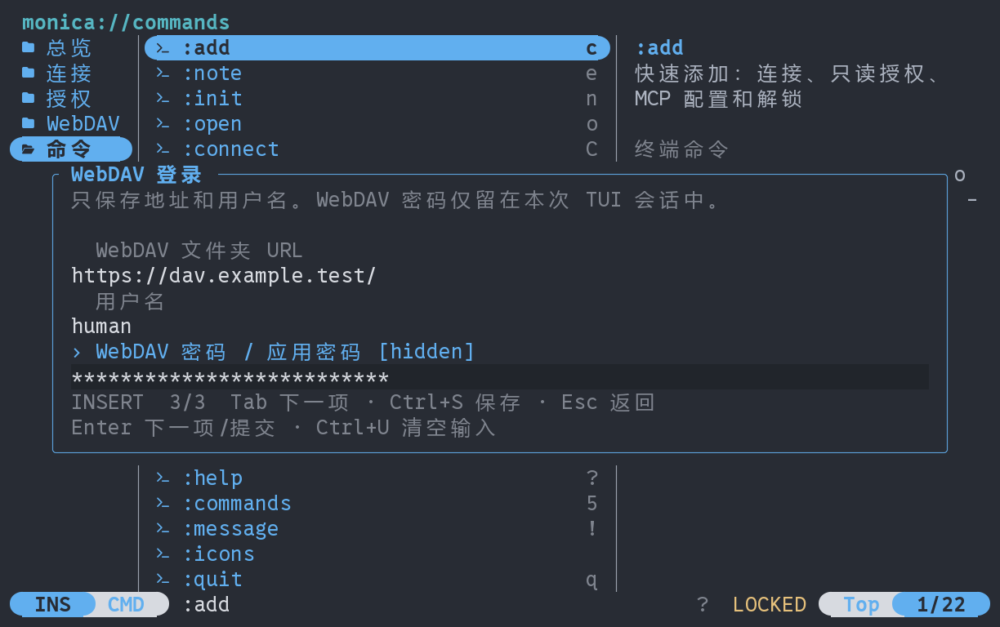

<div align="center">

</div>

<div align="center">

</div>

# Monica CLI

**简体中文** · [English](README.en.md)

[实现与验证](docs/redesign-progress.md) · [克隆与构建依赖](docs/source-checkout.md) · [Token 与 Android 数据约定](docs/token-format.md)

**面向 AI 的本地凭据代理，让 AI 在你的授权范围内使用服务。**

Monica CLI 将服务 Token 保存在本地 MDBX3 加密保险库中。AI 通过 MCP 请求操作，Monica 校验授权、注入凭据并代为发送请求，再将业务结果返回给 AI。你负责管理凭据和权限，AI 通过连接名称和用途备注理解该使用哪个服务，无需直接持有原始 Token。

[快速开始](#快速开始) · [接入 AI](#接入-ai) · [WebDAV 保险库](#webdav-保险库) · [从源码构建](#从源码构建) · [GitHub](https://github.com/Monica-Pass/Monica-cli)


*数据库与嵌套分类主页；由合成测试数据渲染。*

## 能做什么

| 能力 | 使用方式 |
| --- | --- |
| 本地凭据管理 | 使用 MDBX3 加密保存 Token，通过主密码解锁；支持在 TUI 或命令行创建连接。 |
| AI 服务接入 | 提供标准 MCP stdio 接口，供支持 MCP 的 AI 客户端调用 GitHub、GitLab。 |
| 按名称调用 | 为连接设置 `work-github` 等名称和公开用途，AI 可发现授权范围并按名称使用。 |
| 精确授权 | 指定连接、仓库、允许操作、有效期、每分钟限额和总调用次数；默认只读，可随时撤销，且不存在永久授权。 |
| 终端管理页面 | Yazi 风格的三栏布局，配合 Vim 式按键、搜索筛选、详情预览和命令浏览。 |
| 命令行自动化 | 常用命令有缩写；AI 可用明确参数、非交互凭据输入和稳定 JSON 结果完成管理操作。 |
| 多语言界面 | 简体中文和 English，覆盖 TUI、表单、CLI 帮助和人工提示；自动选择语言，也可手动切换并保存。 |
| WebDAV 保险库 | 登录 WebDAV、浏览远端 MDBX 文件、打开本地副本，并手动同步加密保险库。 |

**支持 GitHub / GitLab 通用 API 代理，以及按仓库限制的 Issue 工具。** 完整服务授权后，分支、提交、MR/PR、评论、流水线等接口无需修改 Monica 即可调用；详见[通用 API 使用说明](docs/service-api.md)。 支持官方服务，也支持人工配置自托管服务的 HTTPS API 地址。



## 快速开始

Windows 先按[从源码构建](#从源码构建)产出 `target/release/monica-pass.exe`，再运行 `./scripts/install.ps1 -InstallDir D:\Apps\MonicaCLI`。安装器默认取用该构建产物，也可用 `-Source` 指定其他可执行文件；`-InstallDir` 必须是绝对路径且不能是盘根目录，目标目录非空时必须已是一次 Monica 便携安装，更新前请先退出正在运行的 Monica。安装会写入 `monica-pass.exe` 以及 `monica`、`monicapass` 两个入口并加入用户 PATH，配置、保险库和日志保存在同目录的 `data/`。打开新终端后输入 `monica` 即可启动。安装副本不会随仓库更新；如果 `monica refresh` 之类的较新命令被报为未知命令，说明副本落后于源码，需要重新构建并安装。

默认主页按数据库、嵌套分类和条目组织内容：

1. 首次按 `Enter` 创建数据库，或按 `o` 打开 MDBX 文件。数据库密码用于保护其中的加密内容。
2. 按 `Enter` 解锁查看；用 `n` 创建分类，用 `c` 在当前分类保存服务 Token。
3. 需要配置 AI 授权、MCP 或 WebDAV 同步时，按 `F3` 打开设置。

| 主页操作 | 按键 |
| --- | --- |
| 选择数据库 / 再建一个数据库 | `d` 后按 `Enter` / `n` |
| 打开分类 / 返回上一级 | `Enter` / `h` 或 `Backspace` |
| 切换分类树与条目列表 | `Tab` |
| 新建分类 / 服务 Token | `n` / `c` |
| 重命名分类 / 更换 Token | `e` |
| 移动到其他分类 | `m` |
| 打开 MDBX 文件 | `o` |
| 清除浏览缓存并锁定 | `L` |
| 主页 / 设置 | `F3` |
| 切换语言 / 退出 | `F2` / `q` |

编辑表单用 `Tab` 切换字段，`Ctrl+S` 进入独立的数据库密码步骤。在密码步骤按 `Esc` 返回草稿并清除密码。每次管理操作只在执行期间解锁数据库，条目摘要最多缓存五分钟；这与 AI 代理的五分钟解锁会话相互独立。

设置中按 `c` 可引导式接入服务，按 `a` 单独配置授权。授权**一律会到期**，可随时撤销：有效期默认 240 分钟（命令行 `--ttl`，可指定 1–1440 分钟，留空不再表示永久），还可以用 `--max-calls` 限制该授权能发起的上游请求次数。窗口或次数用尽后，AI 侧只会收到 `reauthorization_required`，必须由人在本地执行 `monica refresh 授权名` 续期（暂仅在命令行提供，TUI 无对应按键），续期会换发新的 capability，需重启 MCP 客户端才会生效。任何授权仍需要代理处于解锁状态。更换 Token 后，该连接原有授权会被撤销。

建议使用至少 **70 列 × 20 行**的 UTF-8 终端。设置页面保留 `/` 筛选、`1`–`5` 切页和 `:` 命令入口。

### 界面语言

内置 **简体中文** 和 **English**。首次运行根据系统语言自动选择，暂不支持的语言回落到 English。

在 TUI 按 `F2` 即可切换并保存，也可以输入 `:lang en`、`:lang zh-CN` 或 `:lang auto`。切换时保留当前选择及表单输入。

```sh
monica-pass --lang en
monica-pass --lang zh-CN --help
monica-pass language en
monica-pass language auto
```

`--lang` 只影响本次运行；`language` 命令保存偏好，省略语言参数可查看当前设置。无需先创建或解锁保险库。偏好保存在配置文件旁的 `gateway.preferences.json` 中；指定其他 `--config` 文件名时会使用对应的偏好文件。

选择优先级为：`--lang` → `MONICA_LANG` 环境变量 → 已保存偏好 → 系统语言。自动模式识别 `LC_ALL`、`LC_MESSAGES`、`LANG`；Windows 未设置这些变量时使用系统区域语言。

连接名称和用途备注按原文显示。CLI 的 JSON 输出、MCP 工具名、参数与错误码保持固定，AI 接入方式与界面语言无关。

### 从命令行开始

也可以用一条命令完成建库、添加连接、授权和解锁：

```sh
monica-pass add work-github --repo your-org/your-repo --note "跟踪产品问题与功能建议" --serve
```

程序会隐藏询问 Token 和主密码。`--serve` 表示保存后继续运行代理；省略它则完成配置后退出，需要使用时再运行 `monica-pass serve`。

GitLab 示例：

```sh
monica-pass add work-gitlab --provider gitlab --repo your-group/your-project --note "处理团队项目的 Issue" --serve
```

需要多个仓库时重复指定 `--repo`。需要允许创建 Issue 时，显式添加 `--allow-write`，或在 TUI 用 `a` 为已有连接创建相应授权。

常用管理命令：

```sh
monica-pass list
monica-pass note work-github "跟踪文档仓库的 Issue"
monica-pass serve
monica-pass lock
```

`init`、`connect`、`grant` 也支持分别创建保险库、保存连接、配置授权。使用 `monica-pass --help` 或 `monica-pass <子命令> --help` 查看参数。

### 短命令与按名称操作

完整命令与缩写等价，常用参数也支持短写：

```sh
monica-pass a work-github -r your-org/your-repo -n "跟踪产品问题" -s
monica-pass ls
monica-pass show work-github
monica-pass e work-github "跟踪文档仓库的问题"
monica-pass m work-github
monica-pass ck work-github
```

| 操作 | 完整命令 | 缩写 |
| --- | --- | --- |
| 快速添加 / 仅保存连接 | `add` / `connect` | `a` / `c` |
| 列出连接 / 编辑用途 | `list` / `note` | `ls` / `e` |
| 建库 / 打开本地库 | `init` / `open` | `n` / `o` |
| 创建授权 / 续期 / 撤销授权 | `grant` / `refresh` / `revoke` | `g` / `rf` / `rv` |
| 解锁并运行 / 锁定 | `serve` / `lock` | `u` / `lk` |
| MCP 配置 / 检查工具 | `settings` / `check` | `m` / `ck` |
| 状态 / WebDAV / 命令查询 | `status` / `webdav` / `commands` | `st` / `dav` / `cmds` |

`-r` 是仓库，`-p` 是服务类型，`-n` 是用途备注，`-t` 是授权分钟数，`-s` 表示添加后运行代理。全局 `-C` 指定配置文件，`-l` 指定界面语言。TUI 的按键仍按页面底部提示使用。

`show` 按连接名称显示用途和相关授权；`m`、`ck` 按授权名称操作，快速添加时二者名称相同。需要访问保险库的管理或同步会先停止代理并等待在途请求结束，完成后保持锁定；需要继续使用 MCP 时运行 `u`，或在 TUI 按 `u`。查询元数据和撤销授权无需停止代理。

### AI 通过 CLI 管理

TUI 中的建库、打开库、添加连接、编辑用途、授权、撤权、WebDAV 和代理管理都有 CLI 入口。AI 可以先查询命令，再按名称操作：

```sh
monica-pass cmds --json
monica-pass cmds add --json
monica-pass ls --json
monica-pass show work-github --json
monica-pass m work-github --json
```

`--json`（`-j`）统一输出 `ok`、`command`、`data` 或固定错误码，并禁用交互提示；结果不随界面语言变化。`--non-interactive` 也可单独用于禁止提示。无子命令时，普通模式打开 TUI，JSON / 非交互模式查询状态。

需要凭据的操作使用 `--secrets-stdin`。例如，AI 可以发起以下命令，由**可信本地启动器**把 `password` 和 `token` 两个字段直接送入该进程的标准输入：

```sh
monica-pass a work-github -r your-org/your-repo -n "跟踪产品问题" --json --secrets-stdin
```

密码和 Token 不需要经过模型，也不放进命令参数、环境变量或输出。缺少安全输入时返回 `secret_input_required` 和所需字段。管道接入示例、输入格式和完整操作对应表见 [CLI 自动化说明](docs/automation.md)。

## 接入 AI

Monica 提供 **MCP stdio** 服务。优先使用程序生成的 MCP 配置：快速创建后会显示并保存配置，也可在授权页选中授权后按 `m`，或执行 `monica-pass m <授权名称>` 获取。

下面是常见的 JSON 配置形式。两个路径都是示例，请以 Monica 实际生成的路径为准；使用 TOML 等格式的客户端，填写相同的 `command` 和 `args` 即可。

```json
{
  "mcpServers": {
    "monica-work": {
      "command": "C:/Tools/Monica/monica-pass.exe",
      "args": [
        "mcp",
        "--client",
        "C:/MonicaData/clients/agent-read.client.json"
      ]
    }
  }
}
```

每份授权绑定一个连接。需要同时使用多个连接时，在 AI 客户端中添加对应的多个 MCP 服务器条目。MCP 客户端负责启动调用入口，人工 TUI 或 `serve` 终端负责解锁代理。

### 让 AI 知道连接的用途

AI 可先调用 `monica_list_connections`，参数为 `{}`，获取当前授权连接的名称、服务、用途备注、仓库范围、可用工具，以及这份 AI 授权的到期时间（保存在保险库里的令牌本身不会过期）。

例如，你将连接命名为 `work-github`，备注写为“跟踪产品问题与功能建议”，AI 就可以根据任务选择这份连接。一次列出 Issue 的 MCP 调用如下：

```json
{
  "name": "github_list_issues",
  "arguments": {
    "connection": "work-github"
  }
}
```

只有一个授权仓库时可省略 `repository`；授权包含多个仓库时必须明确指定。连接名称和备注帮助 AI 理解用途，实际权限始终由授权决定。

### 可用服务工具

| 操作 | GitHub | GitLab |
| --- | --- | --- |
| 列出 Issue | `github_list_issues` | `gitlab_list_issues` |
| 读取 Issue | `github_get_issue` | `gitlab_get_issue` |
| 创建 Issue | `github_create_issue` | `gitlab_create_issue` |
| 服务 API 读取 | `github_api_read` | `gitlab_api_read` |
| 服务 API 写入 / GraphQL | `github_api_write` | `gitlab_api_write` |

读取详情需要 `number`，GitLab 对应项目内的 Issue IID。创建需要明确的写权限，并提供 `title` 和 UUID 格式的 `request_id`；重试同一次创建时复用相同的 ID 和参数，避免重复创建。若返回 `write_outcome_unknown`，先核对远端结果。

## WebDAV 保险库

在 TUI 中就能完成 WebDAV 登录和保险库管理：

1. 按 `i`，填写 WebDAV 文件夹的 **HTTPS 地址、用户名、密码或应用密码**。
2. 在 WebDAV 列表中浏览目录，按 `Enter` 打开 `.mdbx` 文件，再输入保险库主密码。Monica 会建立本地加密副本，之后的网关使用不依赖 WebDAV 持续在线。
3. 按 `s` 手动同步已连接的保险库。如果从本地保险库开始，先按 `P` 将其发布到一个新的远端文件名，再使用 `s` 同步。

WebDAV 密码仅保留在本次 TUI 会话中，退出或输入 `:logout` 后清除；地址和用户名可以记住。命令行同样支持这些操作：

```sh
monica-pass webdav login --url https://dav.example.com/monica/ --username your-name
monica-pass webdav list
monica-pass webdav open vault.mdbx
monica-pass webdav sync
```

命令行的每次 WebDAV 网络操作都需要会话密码，可隐藏输入或通过 `--secrets-stdin` 注入；密码在该命令结束后清除。`monica-pass dav st` 可直接查询已保存的连接信息。同步比较本地与远端版本，双方都有变化时报告冲突；可将本地版本发布到新文件名后再处理。打开另一份保险库会保留原本地文件，并清除现有 AI 授权。

支持通过密码解锁、**不超过 64 MiB 的自包含 MDBX 文件**，不支持外置附件 `.blobs` 或增量同步目录。覆盖远端文件需要服务器支持强 ETag 与条件写入；不支持时仍可读取。

部分服务（如本次验证的坚果云）不返回强 ETag。此时可新建上传、读取和下载，但有本地改动后需按 `P` 或使用 `webdav publish NEW_NAME.mdbx` 保存为新的远端文件。`webdav status --json` 的 `safe_remote_replace: false` 和 TUI 预览会明确提示，程序不会强制覆盖。

MDBX3 指运行库版本，当前原生文件格式标记为 `MDBX-2`。部分旧 Android 客户端生成的 `MDBX-1` 使用另一套加密和解锁结构，无法直接打开；程序会返回 `vault_schema_unsupported`，保留原文件。此时应使用原生 MDBX3 保险库，不能仅修改扩展名或格式标记。

<details>
<summary>查看 WebDAV 登录界面</summary>



</details>

## 凭据与授权

- **凭据由本地网关管理。** Token 加密保存在 MDBX3 中，主密码和 Token 使用隐藏输入或可信进程的标准输入管道，不通过命令参数或环境变量传入。
- **AI 只获得指定权限。** 每份授权限定连接、精确仓库、操作、有效期和请求限额；默认只读，写入必须明确允许。可在授权页按 `x` 或使用 `revoke` 撤销。
- **公开信息与秘密分开。** 名称和用途备注对获授权的 AI 可见，备注中不要填写密码或 Token。客户端授权文件虽不含服务 Token，仍代表访问权限，应妥善保护。
- **MCP 只提供已支持的服务操作。** 没有凭据读取、任意 URL 请求、任意授权头或 Shell 执行工具。对服务的请求使用 HTTPS，拒绝重定向。
- **你控制代理何时可用。** `u` / `serve` 解锁，`L` / `lock` 锁定。退出负责解锁的终端会停止其代理；已经发出的远端操作无法撤回。

这里的隔离针对 MCP 和网关接口。同一系统用户下，拥有任意文件修改或进程调试权限的程序不受这一接口边界保护；需要更强隔离时，应使用独立系统账户或沙箱。详细说明见 [SECURITY.md](SECURITY.md)。

## 从源码构建

需要 **Rust 1.97**、本地 C 编译工具链，以及 MDBX3 引擎源码。当前 Cargo 依赖通过相邻目录引用引擎，构建前请准备以下结构：

```text
workspace/
├── Monica-cli/                 # 本仓库
│   └── Cargo.toml
└── mdbx/                       # MDBX3 引擎源码
    └── crates/
        ├── mdbx-core/
        └── mdbx-storage/
```

在仓库目录中执行：

```sh
cargo build --release --locked
```

Windows GNU 环境需要 MinGW-w64 GCC，并可使用：

```sh
cargo +1.97.0-x86_64-pc-windows-gnu build --release --locked
```

构建产物为 `target/release/monica-pass`，Windows 为 `target/release/monica-pass.exe`。目前已在 Windows GNU 环境验证运行；其他平台需要自行构建验证。

## 数据保存位置

便携安装时，可执行文件旁有一个空的 `monica-pass.portable` 标记文件，配置、保险库及日志默认保存在同目录的 `data/`。安装在 D 盘后，直接启动也使用 D 盘，不受当前工作目录影响。

没有便携标记时，Windows 使用 `%LOCALAPPDATA%/MonicaPass`；Unix 使用 `$XDG_STATE_HOME/monica-pass`，未设置时为 `~/.local/state/monica-pass`。

`--config` 优先于上述默认位置，可用于独立的配置和保险库，例如：

```sh
monica-pass --config C:/MonicaData/gateway.json
```

WebDAV 同步加密保险库，本地的 AI 授权文件和操作日志不会随之上传。备份与恢复方式见[安全文档](SECURITY.md#维护与恢复)。

## 更多资料

- [人工使用手册](docs/human-guide.md)：建库、授权、接入 AI 的完整流程与故障对照表。
- [给 AI 的使用说明](docs/ai-guide.md)：可整段粘贴进项目规则的 AI 侧规范，含全部错误码对应的动作。
- [CLI 自动化](docs/automation.md)：`--secrets-stdin` 协议与稳定 JSON 结果约定。
- [通用服务 API 代理](docs/service-api.md)：`api_read` / `api_write` 的请求格式与限制。
- [安全边界、授权与恢复](SECURITY.md)
- [TUI 布局与交互说明](docs/tui-design.md)
- [第三方许可与致谢](THIRD_PARTY_NOTICES.md)；终端界面参考了 [Yazi](https://github.com/sxyazi/yazi)。
- [问题反馈与功能建议](https://github.com/Monica-Pass/Monica-cli/issues)
